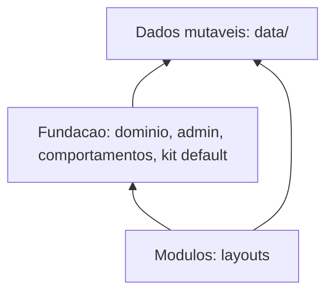

# Checklist de implementação — reorganização de arquivos

Guia operacional para executar a proposta de [README.md](./README.md). O relatório descreve o repositório e o destino. Este checklist é a ordem de implementação. Não muda URL, não muda a árvore de `data/` e não redesenha layout.

Marque cada caixa na medida em que o passo ficar pronto. Uma fase só começa quando a anterior cumpre o critério de pronto. Fases com subfases (4, 6 e 8) executam uma subfase por vez.

---

## Como usar

1. Leia a seção [Decisões fechadas](#decisões-fechadas) e a seção [Invariantes](#invariantes) antes de abrir código.
2. Execute as fases na ordem numérica. Subfases na ordem do sufixo (4.1, depois 4.2).
3. Dentro da fase, leia objetivo e situação atual, execute as caixas de "Como" no lugar indicado em "Onde", e respeite "Fora desta fase".
4. O [fecho por layout](#fecho-por-layout) vem depois da fase 14. Ele completa classic, split, gallery e ateliê sem mudar a essência visual de cada um.
5. Teste ao lado do arquivo que cobre, como já ocorre em `src/`. Ao mover um `*.test.ts`, atualize o caminho na script `test` de [package.json](../../../package.json) na mesma fase. A script lista arquivos, não um glob.

Comando de verificação, em toda fase que tocar TypeScript, CSS importado ou teste:

```bash
npm test
npm run lint
npx tsc --noEmit
```

Conferência manual, quando a fase disser: `npm run dev`, rotas públicas (`/`, `/catalogo`, `/produto/[slug]`, `/carrinho`, `/sobre`) e painel (`/admin/login`, `/admin`, `/admin/personalizacao`). O resultado visual deve permanecer o atual. Diff de classe, seletor ou markup é defeito da fase, salvo caixa que peça o contrário.

---

## Decisões fechadas

Estas escolhas fixam o traçado. Não reabrir no meio de uma fase.

| Tema | Decisão |
|------|---------|
| Carga de CSS | O dono importa o próprio CSS. [app/layout.tsx](../../../app/layout.tsx) fica com reset e theme-bridge. O admin importa `admin.css` em [app/admin/layout.tsx](../../../app/admin/layout.tsx) (primitivos desde a fase 3; shell/Sonner na fase 5). O kit global importa em [app/(public)/layout.tsx](../../../app/(public)/layout.tsx). Tokens e pele de um layout importam no `index` daquele módulo. |
| Forma do CSS extraído de `globals.css` | Arquivo CSS global (`import "./x.css"`), nunca CSS module. Module reescreve o nome da classe. Os CSS modules que já existem continuam modules. |
| Seletores | Copiar o ruleset inteiro, com o mesmo seletor, a mesma especificidade e o mesmo `@media`. Não renomear classe, não trocar `px` por token, não “limpar” regra morta nesta leva. |
| Preview do admin | Slot opcional `Preview` no contrato do layout. O markup esquemático sai de [VitrinePreview.tsx](../../../components/admin/configuracoes/VitrinePreview.tsx) e vai para o módulo. Toolbar, viewport e marcadores de slot ficam no painel. O painel não renderiza o `Home` real. O painel obtém `Preview` por `getLayout(id)`, sem importar `layouts/classic/*` (nem split, gallery, ateliê). |
| Superfícies opcionais | `CatalogPage`, `ProductDetail`, `CartPage` e `AboutPage` entram no tipo. Nenhum dos quatro layouts as implementa. A rota usa a do layout se a chave existir; senão, o componente atual. |
| Essência dos layouts | Header, Footer, Home, NotFound, CSS module já local, fonte Cormorant e breakpoint 1100 do ateliê permanecem como estão. O fecho só muda o lugar do CSS de token/pele e extrai o `Preview`. |
| Barrels | [src/services/index.ts](../../../src/services/index.ts) e [src/schemas/index.ts](../../../src/schemas/index.ts) passam a exportar o conjunto real. `app/` e `components/` importam o barrel. Arquivo dentro de `src/services/` ou `src/schemas/` continua importando o arquivo irmão, para não criar ciclo. |
| Fachadas | Na mudança `src/lib/` → `src/foundation/`, o caminho antigo reexporta o novo até a fase 12. Arquivo novo não nasce em `src/lib/`. |
| `site-config-tabs.ts` | Fase 13, isolada. Não é pré-requisito das fases 1–12. |
| Fronteiras | Fase 14, com `no-restricted-imports` no ESLint já do repositório. Sem dependência nova. |
| Observabilidade | [src/lib/observability/](../../../src/lib/observability) vai para `src/foundation/observability/`. O relatório não cita essa pasta; ela existe no código. |
| Campo `targets` | Lista de pastas de `data/` no tipo `DataMigration`. O arquivo [targets.ts](../../../src/foundation/data/migrations/targets.ts) continua sendo o helper `fileChangeIfMigrated`. Não renomear esse módulo. |
| `src/config/` | Permanece. Defaults de site e de copy não descem para `behaviors/`. O resolver `store-copy.ts` sim. |

---

## Invariantes

Não violar em fase alguma.

- `data/` e `data-dev/` na raiz, com a mesma árvore (`produtos/`, `categorias/`, `banners/`, `pedidos/`, `clientes/`, `configuracoes/`, `indices/`, `imagens/`, `analytics/`).
- Sync em [.github/workflows/sync.yml](../../../.github/workflows/sync.yml) e `dataRepoPath()` continuam com o prefixo `data/` só na fronteira Git. Path relativo nos services, sem prefixo `data/`.
- Segmentos de URL: `(public)`, `admin`, `api/v1`, `media`. `revalidate = 120` nas rotas públicas que já têm.
- Alias `@/`. App Router na raiz `app/`.
- Enum `siteLayoutSchema` em [src/schemas/site-config.ts](../../../src/schemas/site-config.ts): `"classic" | "split" | "gallery" | "atelie"`. Layout novo continua sendo mudança de fundação (enum) mais pasta do módulo. Esta leva não acrescenta id.
- Ledger em `data/configuracoes/migrations.json`. O runner é o único escritor. `id` e `order` únicos. Repair de índices permanece `id` `2026-07-indices-repair`, `order` 90, mesmo que o arquivo mude de pasta.
- Layout não lê disco, não chama service, não importa outro layout. Kit não importa pasta de layout. Admin não importa arquivo interno de `classic/`, `split/`, `gallery/` ou `atelie/`. Service não importa `components/`.
- Carrinho no cliente: `CartProvider` continua montado em [app/(public)/layout.tsx](../../../app/(public)/layout.tsx), porque liga `mostrarCarrinho`. Botão e página são superfície (kit).
- JSON da loja não muda de forma nesta leva. A fase 9 só declara `targets` nas migrations já existentes. A fase 13 não altera o JSON gravado.

---

## Três camadas

Dependência de código aponta para a fundação. `data/` não importa código.



- **Fundação.** Schemas, services, adapters, índices, auth, behaviors, painel admin e kit default da vitrine (o visual usado quando o layout não substitui a superfície).
- **Módulos.** Um layout por pasta, com CSS próprio. Consome props já carregadas. Pode importar o kit. Não importa outro layout.
- **Dados mutáveis.** `data/` e `data-dev/`. Admin e, em poucos casos, a vitrine (lead, analytics) escrevem pela fundação.
- **`app/` não é quarta camada.** Rotas finas: leem a fundação e delegam ao módulo ativo ou ao kit.

---

## Árvore alvo

Itens novos estão marcados na proposta do relatório. O resto é agrupamento do que já existe. `src/lib/` não aparece: durante as fases 8 e 9 ele só reexporta; na fase 12 ele some.

```
app/
  (public)/                 rotas finas
  admin/
  api/  media/  icon.tsx  sitemap.ts  robots.ts
  layout.tsx                fontes padrão, data-layout, reset, theme-bridge
  styles/
    reset.css
    theme-bridge.css
  globals.css               encolhe fase a fase; apagar quando ficar vazio

src/
  schemas/
  services/
  config/                   permanece
  foundation/
    data/                   adapters, commit, paths
      migrations/           registry + um arquivo por id
    indices/
    auth/
    http/                   hoje src/lib/api
    cache/                  inclui cache-tags
    admin/                  revalidate, multipart, rótulos, agregados do dashboard
    behaviors/
      whatsapp/
      navigation/
      catalog/
      pricing/
      cart/
      copy/
      theme/
      media/
      feedback/             consentimento e lead (hoje front/)
      viewport/             breakpoints 768/1024
      view-models/          fase 11
    platform/               slug, csv, rate-limit, env, instagram, br, analytics-date
    observability/

components/
  ui/                       paginação, voltar ao topo — não mover
  admin/
    shell/
    produtos/
    categorias/
    clientes/
    pedidos/
    personalizacao/         hoje configuracoes/ + NavegacaoEditor
    dashboard/              já está no lugar; não reorganizar por dentro
    http/
  public/
    kit/
      catalog/
      product/
      cart/
      chrome/
      feedback/
    layouts/
      contract/             types, registry, options, banner-slots
      classic/  split/  gallery/  atelie/
```

`components/ui/` permanece. Paginação do catálogo e do painel continuam nesse primitivo.

---

## Dependências permitidas

| De | Para | Permitido |
|----|------|-----------|
| `app/` | services (barrel), cache, `getLayout`, kit | sim |
| layout (`classic/`, `split/`, `gallery/`, `atelie/`) | schemas (tipos), behaviors puros, kit, `components/ui` | sim |
| layout | outro layout, `src/foundation/data`, `src/services`, `fs` | não |
| `layouts/registry.tsx` | os quatro módulos de layout | sim — é o único compositor |
| kit | schemas, behaviors, `components/ui` | sim |
| kit | pasta de um layout | não |
| admin | services, schemas, `getLayout`, `options`, `banner-slots`, tipo do módulo | sim |
| admin | arquivo interno de `layouts/<id>/` | não |
| service | schemas, foundation/data, indices | sim |
| service | `components/` | não |
| `data/` | qualquer código | não |

`layouts/contract/` (ou os arquivos de contrato que ainda estejam na raiz de `layouts/` até serem agrupados) pode definir tipos. Quem instancia os quatro módulos é só o registry.

---

## Onde nasce um arquivo novo

| Se o arquivo… | Vai para |
|---------------|----------|
| valida ou descreve JSON da loja | `src/schemas/` |
| lê ou grava uma entidade | `src/services/<entidade>.service.ts` |
| adapta disco, GitHub, índice, sessão, HTTP | `src/foundation/<área>/` |
| transforma JSON antigo | `src/foundation/data/migrations/<id>.ts`, registrada no registry |
| calcula preço, WhatsApp, menu, copy, tema | `src/foundation/behaviors/<área>/` |
| é tela do admin | `components/admin/<feature>/` |
| é visual default da vitrine | `components/public/kit/<superfície>/` |
| é visual de um layout | `components/public/layouts/<id>/` |
| é primitivo sem noção de loja | `components/ui/` |
| é página ou route handler | `app/`, fino |
| é JSON, imagem ou índice da loja | `data/` |

Enquanto a fachada existir, import antigo `@/src/lib/...` ainda compila. Arquivo criado na fase vai direto para o destino novo.

---

## Mapa de movimentação

Use este mapa nas fases 6, 7, 8 e 9. Não inventar destino diferente.

### `src/lib/` → `src/foundation/`

| Origem | Destino |
|--------|---------|
| `src/lib/data/**` exceto o que a fase 9 tratar à parte | `src/foundation/data/**` |
| `src/lib/indices/**` | `src/foundation/indices/**` |
| `src/lib/auth/**` | `src/foundation/auth/**` |
| `src/lib/api/**` | `src/foundation/http/**` |
| `src/lib/cache/**` | `src/foundation/cache/**` |
| `src/lib/cache-tags.ts` | `src/foundation/cache/cache-tags.ts` |
| `src/lib/admin/**` | `src/foundation/admin/**` |
| `src/lib/dashboard-aggregates.ts` e o teste | `src/foundation/admin/` |
| `src/lib/wa.ts`, `wa-*.ts` e testes | `src/foundation/behaviors/whatsapp/` |
| `src/lib/navigation.ts`, `navigation-admin.ts` e teste | `src/foundation/behaviors/navigation/` |
| `src/lib/categories-tree.ts`, `product-referencia.ts`, `pagination.ts` e teste | `src/foundation/behaviors/catalog/` |
| `src/lib/front/catalog-facets.ts`, `client-filter.ts` e testes | `src/foundation/behaviors/catalog/` |
| `src/lib/front/pricing.ts`, `variants.ts` | `src/foundation/behaviors/pricing/` |
| `src/lib/front/cart.ts` | `src/foundation/behaviors/cart/` |
| `src/lib/front/store-copy.ts` | `src/foundation/behaviors/copy/` |
| `src/lib/front/site-theme-css.ts` | `src/foundation/behaviors/theme/` |
| `src/lib/front/media.ts`, `media-image.ts`, `format.ts` | `src/foundation/behaviors/media/` |
| `src/lib/front/analytics-consent.ts`, `client-lead.ts` | `src/foundation/behaviors/feedback/` |
| `src/lib/front/breakpoints.ts` | `src/foundation/behaviors/viewport/breakpoints.ts` |
| `src/lib/slug.ts`, `csv.ts`, `rate-limit.ts`, `env.ts`, `instagram.ts`, `analytics-date.ts` | `src/foundation/platform/` |
| `src/lib/br/**` | `src/foundation/platform/br/` |
| `src/lib/observability/**` | `src/foundation/observability/**` |

`src/schemas/navigation.ts` permanece em `src/schemas/`. Não entra em `behaviors/navigation/`.

`src/config/default-site-config.ts` e `src/config/store-copy-defaults.ts` permanecem em `src/config/`.

O breakpoint 1100 em [layouts/atelie/header/breakpoints.ts](../../../components/public/layouts/atelie/header/breakpoints.ts) permanece na pasta do ateliê.

### Admin flat → pastas de feature

| Arquivo atual em `components/admin/` | Destino |
|--------------------------------------|---------|
| `AdminSidebar.tsx`, `AdminToaster.tsx`, `adminToast.ts`, `AdminLoginShell.tsx`, `AdminLogin.module.css`, `ConfirmDialog.tsx`, `AdminPageActions.tsx`, `AdminBusy.tsx`, `AdminNavRow.tsx`, `LoadingButton.tsx`, `FieldHint.tsx` | `shell/` |
| `ProductForm.tsx`, `ProductImageGallery.tsx`, `ProductVariantsEditor.tsx`, `DeleteProductButton.tsx`, `ProductOrderSearch.tsx`, `CategoryMultiSelect.tsx`, `ImageField.tsx` | `produtos/` |
| `CategoriasClient.tsx` | `categorias/` |
| `ClientesClient.tsx`, `ClientCombobox.tsx` | `clientes/` |
| `PedidosClient.tsx`, `PedidoForm.tsx` | `pedidos/` |
| `BannersClient.tsx` | `personalizacao/` — banners do admin vivem na personalização; a rota `banners/` já redireciona |
| `mutationFetch.ts`, `uploadClient.ts` | `http/` |
| `PersonalizacaoClient.tsx`, `NavegacaoEditor.tsx`, pasta `configuracoes/**` | `personalizacao/` — `NavegacaoEditor.tsx` entra em `personalizacao/navegacao/` |
| `DashboardClient.tsx` e `dashboard/**` | permanecem; `dashboard/` já é feature |

`DashboardClient.tsx` pode ficar em `dashboard/DashboardClient.tsx` na subfase 6.1 só se o move for mecânico e todos os imports de página forem atualizados. Se isso inflar a subfase, deixe o client na raiz de `admin/` e registre a caixa como adiada para o fim da fase 6. Não misture esse move com produtos ou pedidos.

### Raiz de `components/public/` → kit

| Origem | Destino |
|--------|---------|
| `CatalogPageView.tsx`, `CatalogFilters.tsx`, `CategoryNav.tsx`, `CategoryNav.module.css` | `kit/catalog/` |
| `ProductCard.tsx`, `ProductDetailClient.tsx`, `ProductGallery.tsx`, `ProductVariantPicker.tsx`, `ProductQuantityStepper.tsx` | `kit/product/` |
| `cart/**` (`CartProvider`, `CartPageClient`, `CartToast`, `CartHeaderButton`, `CartCatalogAction`) | `kit/cart/` |
| `StoreBrand.tsx`, `StoreBrand.module.css`, `PublicFooterSections.tsx`, `footerContact.tsx`, `FooterSocialLinks.tsx`, `BannerSlots.tsx` | `kit/chrome/` |
| `layouts/headerNav.tsx`, `layouts/PublicMobileNav.tsx`, `layouts/PublicMobileNav.module.css` | `kit/chrome/` — hoje estão dentro de `layouts/` e o destino do relatório é o kit |
| `WhatsAppButton.tsx`, `WhatsAppGateProvider.tsx`, `InstagramButton.tsx`, `ClientLeadModal.tsx` | `kit/feedback/` |
| `analytics/**` | `kit/feedback/analytics/` |
| `icons/StorefrontIcons.tsx` | `kit/chrome/icons/` — usado por PDP, carrinho e layouts |
| `SiteChrome.tsx` | apagar na fase 7, depois de confirmar zero consumidores |

---

## Critério de pronto comum

Toda fase termina com:

- [ ] `npm test` verde. Caminhos movidos já estão na script `test`.
- [ ] `npm run lint` verde nos arquivos da fase.
- [ ] `npx tsc --noEmit` verde.
- [ ] Nenhum import aponta para arquivo que deixou de existir, salvo reexport deliberado da fachada.
- [ ] Nenhuma classe CSS foi renomeada. Nenhum layout ganhou `CatalogPage`, `ProductDetail`, `CartPage` ou `AboutPage`.
- [ ] Conferência manual das rotas citadas na fase, sem diff visual intencional.

---

## Fachadas — regra das fases 8 e 9

Para cada arquivo movido:

1. O arquivo passa a viver só no destino.
2. No caminho antigo, um arquivo de uma linha reexporta o destino (`export * from "@/src/foundation/..."` ou os símbolos nomeados que o arquivo já exportava).
3. Testes movem junto e importam o destino, não a fachada.
4. Call sites podem continuar no caminho antigo até a fase 10 (barrels) e a fase 12 (fim das fachadas). Não é obrigatório reescrever todos os imports na fase do move.
5. Não criar fachada para arquivo que ninguém importa. Apagar e seguir.

A fachada não contém lógica. Se o move exigir ajuste de import interno (o arquivo movido importava um vizinho pelo caminho relativo), esse ajuste acontece no arquivo novo, e a fachada só reexporta.

---

## Fase 1 — Contrato opcional de superfícies

### Objetivo

O tipo `SiteLayoutModule` aceita catálogo, PDP, carrinho e sobre. A rota renderiza a superfície do layout quando a chave existe e, senão, o componente de hoje. Nenhum layout preenche essas chaves.

### Situação atual

O contrato em [components/public/layouts/types.ts](../../../components/public/layouts/types.ts) tem só `Header`, `Footer`, `Home` e `NotFound`.

As rotas não consultam o registry para essas telas:

| Rota | O que renderiza hoje |
|------|----------------------|
| [app/(public)/catalogo/page.tsx](../../../app/(public)/catalogo/page.tsx), `catalogo/page/[page]`, `catalogo/busca` | `CatalogPageView` com `{ query }` |
| [app/(public)/produto/[slug]/page.tsx](../../../app/(public)/produto/[slug]/page.tsx) | `ProductDetailClient` com produto, copy e rótulos já carregados |
| [app/(public)/carrinho/page.tsx](../../../app/(public)/carrinho/page.tsx) | `CartPageClient` com `{ site }`, ou `notFound()` se `mostrarCarrinho` for falso |
| [app/(public)/sobre/page.tsx](../../../app/(public)/sobre/page.tsx) | JSX inline na própria page (não há componente) |
| [app/(public)/page.tsx](../../../app/(public)/page.tsx) | `Home` do layout — não entra nesta fase |
| [app/(public)/not-found.tsx](../../../app/(public)/not-found.tsx) | `NotFound` do layout — não entra nesta fase |

`CatalogPageView` ainda busca dados por dentro (cache e árvore de categorias). Isso só muda na fase 11. Nesta fase o fallback continua sendo esse componente, com a mesma prop `query`.

### Onde

- [components/public/layouts/types.ts](../../../components/public/layouts/types.ts)
- [components/public/layouts/registry.tsx](../../../components/public/layouts/registry.tsx) — reexportar os tipos novos se o barrel de tipos passar por aqui
- `app/(public)/catalogo/page.tsx`
- `app/(public)/catalogo/page/[page]/page.tsx`
- `app/(public)/catalogo/busca/page.tsx`
- `app/(public)/produto/[slug]/page.tsx`
- `app/(public)/carrinho/page.tsx`
- `app/(public)/sobre/page.tsx`
- `components/public/layouts/classic/index.ts`, `split/index.ts`, `gallery/index.ts`, `atelie/index.ts` — conferir que o objeto do módulo não ganha as chaves novas

### Como

- [x] Em `types.ts`, declarar props iguais ao que a rota já passa hoje:
  - `CatalogPageProps`: `{ query: CatalogViewQuery }` (importar o tipo de `CatalogPageView`, ou extraí-lo para `types.ts` se o import do kit a partir do contrato criar ciclo; se criar ciclo, duplicar o tipo mínimo `{ page, pageSize, q?, categoria?, tamanho?, cor? }` no contrato e manter `CatalogViewQuery` compatível).
  - `ProductDetailProps`: o mesmo objeto que `ProductDetailClient` já recebe. Importar o tipo do componente se ele for exportado; se for só `type Props` interno, exportar esse tipo sem mudar campos.
  - `CartPageProps`: `{ site: SiteConfig }`.
  - `AboutPageProps`: `{ site: SiteConfig }`. A page de sobre hoje deriva sozinha `wa`, endereço e rótulos. Não antecipar a fase 11.
- [x] Acrescentar no `SiteLayoutModule` as chaves opcionais `CatalogPage?`, `ProductDetail?`, `CartPage?`, `AboutPage?`. As quatro atuais continuam obrigatórias.
- [x] Em cada page pública listada acima, obter o módulo com `getLayout(site.layout)` (a page de catálogo que hoje não carrega `site` passa a chamar `getCachedSiteConfig` só para ler `site.layout`; o `query` enviado ao fallback permanece o mesmo).
- [x] Resolver a superfície assim: se a chave existir, renderizar a do módulo com as props atuais; senão, renderizar o componente ou o JSX atual. No carrinho, o `notFound()` por `mostrarCarrinho` continua antes dessa escolha.
- [x] No sobre, o JSX atual vira o ramo `else`. Não extrair um componente novo só para “organizar”. O fallback permanece na page até a fase 11, que pode extraí-lo para o kit sem mudar markup.
- [x] Reexportar os tipos novos em [components/public/layouts/index.ts](../../../components/public/layouts/index.ts) se esse barrel já reexporta `HomeProps`.
- [x] Confirmar que `classicLayout`, `splitLayout`, `galleryLayout` e `atelieLayout` não definem as quatro chaves.

### Fora desta fase

- Não implementar superfície em layout nenhum.
- Não fazer `CatalogPageView` deixar de buscar dados.
- Não acrescentar `Preview`.
- Não mover arquivo de pasta.
- Não editar `globals.css`.

### Pronto quando

- [x] Com `site.layout` em classic, split, gallery e ateliê, catálogo, PDP, carrinho e sobre renderizam o mesmo componente de antes.
- [x] Um teste ou uma verificação manual temporária: ao atribuir `CatalogPage` num módulo de teste local e reverter em seguida, a rota usa o componente do módulo. Não commitar layout com a chave preenchida.
- [x] Critério de pronto comum, mais as quatro rotas públicas e a home (home não deve ter mudado).

---

## Fase 2 — Reset e theme-bridge

### Objetivo

O documento raiz passa a carregar o CSS estrutural e o gancho do tema por arquivos próprios. O resto de `globals.css` continua no ar, importado, até as fases 3, 4 e 5 esvaziarem.

### Situação atual

[app/layout.tsx](../../../app/layout.tsx) importa `./globals.css` e `./layout-tokens.css`. O `<html>` e o `<body>` já recebem `data-layout={site.layout}` e o style de `siteThemeStyle(site)`.

`globals.css` tem cerca de 8144 linhas e mistura assuntos. Âncoras úteis (os números mudam assim que um bloco sai; classifique pelo seletor, não pelo número):

| Seletor ou comentário | Papel |
|----------------------|--------|
| bloco `:root` inicial (`--vn-bp-md`, `--vn-primary`, espaços, gutter, safe area) | tokens de documento e fallback de tema |
| `html, body` | reset tipográfico do documento |
| `html:has(.admin-login-root)` | login do admin — fase 5 |
| `*::-webkit-scrollbar` | chrome do documento; as variáveis `--vn-scrollbar-*` nascem em `layout-tokens.css` |
| `.skip-link` e regras de `:focus-visible` do documento, se existirem | reset |
| `.btn`, `.card-product`, `.catalog-page`, `.product-detail` | vitrine — fases 3 e 4 |
| `.admin-shell` (também antes do comentário “Admin pages”) | admin — fase 5 |
| comentário `Client lead modal` | feedback — fase 4 |
| comentário `Storefront loading skeletons` | kit — fase 3 |
| comentário `Sobre` | fase 4 |
| comentário `Cart (public)` | fase 4 |
| `body[data-layout="gallery"]` | fecho do gallery |
| comentário `Sonner` | admin — fase 5 |

[app/layout-tokens.css](../../../app/layout-tokens.css) fica inteiro nesta fase. Ele mistura tokens por `[data-layout]` e regras de superfície (`.vn-section-title`, `.grid-products`, catálogo, PDP, sobre) que consomem `--vn-layout-*`. Essas regras de superfície saem na fase 3. Os blocos `[data-layout="…"]` saem no fecho.

### Onde

- Criar `app/styles/reset.css`
- Criar `app/styles/theme-bridge.css`
- [app/layout.tsx](../../../app/layout.tsx)
- [app/globals.css](../../../app/globals.css) — só os blocos que saírem

### Como

- [x] Criar `app/styles/reset.css` e mover, verbatim, as regras que valem para todo documento, admin incluído: `html, body` de margem e fonte; scrollbar; `.skip-link`; foco visível estrutural; `box-sizing` se estiver no topo do arquivo. Incluir o comentário dos breakpoints 768/1024 que abre o arquivo, porque ele documenta o contrato do documento.
- [x] Criar `app/styles/theme-bridge.css` com o bloco `:root` de variáveis `--vn-*` que `siteThemeStyle` sobrescreve no `style` do `<html>` (cor, raio, fonte, container, espaços). Não colocar regra de classe (`.btn`, `.admin-shell`, `.card-product`) nesse arquivo.
- [x] Se uma variável do `:root` for usada só pelo admin ou só pelo kit, ela acompanha o dono na fase correspondente, não o theme-bridge. Na dúvida, deixar no `:root` do theme-bridge e anotar na caixa, em vez de duplicar. Anotação: `--vn-pagination-dock-h` ficou no theme-bridge (uso misto vitrine/admin). `--admin-mobile-bar-h`, `--admin-config-tabs-h` e `--admin-toast-offset-*` ficaram no `:root` residual de `globals.css` (dono admin, fase 5), junto das regras de lift de toast.
- [x] Em `app/layout.tsx`, importar `./styles/reset.css` e `./styles/theme-bridge.css` antes de `./globals.css` e `./layout-tokens.css`. Manter os dois imports antigos.
- [x] Apagar de `globals.css` somente o que foi copiado. Conferir que o seletor não ficou nos dois arquivos.
- [x] Não apagar `layout-tokens.css`.

### Fora desta fase

- Não mover `.admin-shell`, catálogo, PDP, carrinho, sobre, lead, gallery nem Sonner.
- Não alterar `siteThemeStyle` nem as fontes `next/font`.

### Pronto quando

- [x] Home, catálogo, PDP, admin e login com a mesma aparência.
- [x] Inspecionar o `<html>`: `data-layout` presente e variáveis `--vn-*` ainda aplicadas.
- [x] Critério de pronto comum.

---

## Fase 3 — CSS base da vitrine compartilhada

### Objetivo

Botão, cartão, grade, catálogo, PDP, skeletons e paginação pública saem de `globals.css` (e as regras de superfície saem de `layout-tokens.css`) para CSS global do kit, importado pelo layout público. Os componentes `.tsx` continuam na raiz de `components/public/` até a fase 7.

### Situação atual

Classes globais (`.btn`, `.card-product`, `.catalog-page`, `.product-detail`, `.grid-products`, `.vn-section-title`, skeletons, paginação) servem classic, split e gallery. Parte mora em `globals.css`, parte em `layout-tokens.css` a partir do comentário “Shared storefront surfaces”. Regras `[data-layout="classic"]`, `[data-layout="split"]` e `[data-layout="gallery"]` que só refinam essas superfícies ficam em `layout-tokens.css` até o fecho. Não movê-las agora.

O kit ainda não tem pasta. Criar o CSS no destino final para a fase 7 só mover o TypeScript.

**Desvio documentado:** o painel também usa `.btn*` e a base `.pagination-dock` / `.pagination-nav` / `.back-to-top`. Mover só para o kit quebraria o admin. Nesta fase, além do kit, recriar esses primitivos em `components/admin/shell/admin.css` (importado em `app/admin/layout.tsx`). A “uma definição só” vale **por superfície** (kit na vitrine; cópia admin no painel); a busca no repo pode achar o mesmo seletor duas vezes. A fase 5 absorve o restante do CSS admin nesse arquivo já existente.

### Onde

- Criar `components/public/kit/catalog/catalog.css` — `.catalog-page*`, `.catalog-filters*`, `.grid-products`, `.vn-section-title` quando forem da listagem
- Criar `components/public/kit/product/product.css` — `.card-product*`, `.product-detail*`, `.product-gallery*`, `.badge`
- Criar `components/public/kit/chrome/chrome.css` — `.btn` e utilitários de vitrine que não são admin, carrinho, sobre nem lead
- Criar `components/public/kit/catalog/skeletons.css` — bloco “Storefront loading skeletons”
- Criar `components/admin/shell/admin.css` — cópia dos `.btn*` do painel e da base de paginação/back-to-top (desvio)
- [app/(public)/layout.tsx](../../../app/(public)/layout.tsx) — import desses CSS do kit
- [app/admin/layout.tsx](../../../app/admin/layout.tsx) — import de `admin.css`
- `app/globals.css` e `app/layout-tokens.css`

### Como

- [x] Localizar cada ruleset pelo seletor, não pela linha. Um ruleset cujo seletor seja só de admin (`.admin-shell`, `.admin-login-root`) não entra aqui, mesmo que esteja no meio do arquivo.
- [x] Copiar o ruleset verbatim para o CSS do dono. Um `@media` que misture seletor de vitrine e seletor de admin se divide: a regra de vitrine vai para o kit, a de admin fica para a fase 5 (ou, no caso do hide de `.back-to-top` com toaster, a parte admin já pode viver em `admin.css` / residual em `globals`).
- [x] Mover de `layout-tokens.css` o bloco “Shared storefront surfaces” e as regras seguintes que estilizam `.vn-section-title`, `.grid-products`, `.card-product`, `.catalog-page`, `.catalog-filters`, `.product-detail`, `.product-gallery` sem prefixo `[data-layout]`. Deixar no arquivo os blocos `:root`, `[data-layout="classic"]`, `[data-layout="split"]`, `[data-layout="gallery"]` e os refinamentos que usam esse prefixo, inclusive o `@media (min-width: 1024px)` do grid classic.
- [x] Importar os CSS novos em `app/(public)/layout.tsx`. Não importar no `app/layout.tsx` raiz: o painel não precisa do CSS do kit.
- [x] Apagar os rulesets movidos da origem. Por superfície: definição no kit (vitrine) ou em `admin.css` (painel); sem residual desses seletores base em `globals.css`. Exceção deliberada: o mesmo seletor pode existir em kit e em `admin.css`.
- [x] Paginação: regras de `.pagination-dock` usadas na vitrine vão para `kit/catalog/catalog.css`. Regras `.admin-shell .pagination-dock…`, `.admin-shell .back-to-top` e `.admin-panel .pagination-nav--dock` ficam em `globals` para a fase 5. A base da paginação também é recriada em `admin.css`.
- [x] Recriar em `components/admin/shell/admin.css` os primitivos que o admin ainda consome (`.btn` base + primary/dark/ghost + `.btn-icon` / `.btn-sm` / `.btn-ghost-danger` / `.btn-quiet*`, e base `.pagination-*` / `.back-to-top*`) e importar em `app/admin/layout.tsx`.

### Fora desta fase

- Não mover carrinho (`.cart-page`), sobre (`.sobre-page`), modal de lead, Sonner, login, `.admin-shell`.
- Não mover pele `body[data-layout="gallery"]` nem refinamentos `[data-layout="classic"|"split"|"gallery"]`.
- Não converter para CSS module.
- Não mover os `.tsx`.

### Pronto quando

- [x] `/`, `/catalogo`, `/catalogo/busca`, um PDP e a paginação pública iguais ao antes, em classic.
- [x] Repetir catálogo e PDP com layout split e gallery no `configuracoes` local (ou no seed), porque gallery e split dependem das variáveis que continuam em `layout-tokens.css`.
- [x] `/admin` sem regressão de botões/paginação (primitivos em `admin.css`) e chrome ainda em `globals.css` pela raiz.
- [x] Critério de pronto comum.

---

## Fase 4 — Carrinho, sobre e feedback

Três subfases. Cada uma esvazia um bloco e importa o CSS no layout público, junto dos imports da fase 3.

### Fase 4.1 — Carrinho

### Objetivo

O CSS público do carrinho mora em `kit/cart` e carrega com a vitrine.

### Situação atual

Comentário “Cart (public)” em `globals.css` (por volta da linha 7540 antes das fases anteriores). Componentes já estão em `components/public/cart/`. A page é [app/(public)/carrinho/page.tsx](../../../app/(public)/carrinho/page.tsx).

### Onde

- Criar `components/public/kit/cart/cart.css`
- `app/(public)/layout.tsx`
- `app/globals.css`

### Como

- [x] Mover verbatim todo ruleset cujo seletor seja `.cart-page` ou desça de `.cart-page`, e o que o comentário do carrinho agrupa e não seja admin.
- [x] Deixar regras `[data-layout="gallery"] .cart-page…` em `layout-tokens.css` ou em `globals.css` se ainda estiverem lá. Elas saem no fecho do gallery.
- [x] Importar `cart.css` em `app/(public)/layout.tsx`.
- [x] Apagar o bloco da origem.

### Fora desta fase

- Não mover `CartProvider` nem a page.
- Não alterar a lógica de `mostrarCarrinho`.

### Pronto quando

- [x] `/carrinho` com itens, vazio e com WhatsApp, em classic e em gallery (o título gallery ainda vem do token antigo).
- [x] Critério de pronto comum.

### Fase 4.2 — Sobre

### Objetivo

O CSS de `.sobre-page` mora no kit, ao lado do destino futuro da página.

### Situação atual

A page [app/(public)/sobre/page.tsx](../../../app/(public)/sobre/page.tsx) usa classes `container sobre-page`, `sobre-page__title`, `sobre-page__lead`, `sobre-page__list`, `sobre-page__label`, `sobre-page__cta`. Há regras em `globals.css` (comentário “Sobre”) e em `layout-tokens.css` (bloco “About” e refinamentos `[data-layout]`).

### Onde

- Criar `components/public/kit/catalog/about.css` — o relatório não abre pasta `about/`; a superfície sobre é página do kit. Usar este arquivo até existir componente. Não criar `AboutPage` de layout.
- `app/(public)/layout.tsx`
- `app/globals.css` e o bloco “About” de `layout-tokens.css` que não tenha prefixo `[data-layout]`

### Como

- [x] Mover regras `.sobre-page` sem prefixo `[data-layout]`.
- [x] Manter `[data-layout="classic"] .sobre-page…` e `[data-layout="split"] .sobre-page…` onde estão, para o fecho.
- [x] Importar `about.css` no layout público.
- [x] Apagar a origem correspondente.

### Fora desta fase

- Não extrair o JSX de `sobre/page.tsx` para um componente.

### Pronto quando

- [x] `/sobre` em classic e em split, com e sem botões de WhatsApp e Instagram.
- [x] Critério de pronto comum.

### Fase 4.3 — Lead, consentimento e toasts da vitrine

### Objetivo

Modal de lead e o que for CSS de consentimento ou de toast da vitrine (não Sonner do admin) carregam com o kit de feedback.

### Situação atual

Comentário “Client lead modal (WhatsApp gate)” em `globals.css`. O provider está em `components/public/WhatsAppGateProvider.tsx` e `ClientLeadModal.tsx`. Consentimento está em `components/public/analytics/` com CSS module próprio (`ConsentBanner.module.css`) — esse module não se mexe. Há um ajuste de toast acima do dock de paginação no topo de `globals.css` (comentário “Lift bottom-right toasts”).

### Onde

- Criar `components/public/kit/feedback/feedback.css`
- `app/(public)/layout.tsx`
- `app/globals.css`

### Como

- [x] Mover o bloco do modal de lead verbatim.
- [x] Mover o ajuste de toast da vitrine se o seletor não for o Sonner do admin (o Sonner tem comentário próprio e fica na fase 5).
- [x] Não mover `ConsentBanner.module.css`.
- [x] Importar `feedback.css` no layout público.
- [x] Apagar a origem.

### Fora desta fase

- Não mudar o fluxo de coleta de lead nem o texto do modal.

### Pronto quando

- [x] Abrir o gate de WhatsApp num produto ou no botão flutuante e ver o modal como antes.
- [x] Banner de consentimento como antes.
- [x] Critério de pronto comum.

---

## Fase 5 — CSS do admin

### Objetivo

Login, chrome `.admin-shell`, docks de paginação do painel e Sonner saem de `globals.css` e passam a carregar só nas rotas de admin.

### Situação atual

[components/admin/shell/admin.css](../../../components/admin/shell/admin.css) **já existe** desde a fase 3, com a cópia dos primitivos compartilhados (`.btn*` do painel e base de paginação/back-to-top), e já é importado em [app/admin/layout.tsx](../../../app/admin/layout.tsx) (cobre painel e login). O restante do CSS admin ainda entra porque a raiz importa `globals.css`: `.admin-shell`, busy-bar, `.admin-loading*`, overrides `.admin-shell .pagination-dock…` / `.admin-shell .back-to-top` / `.admin-panel .pagination-nav--dock`, login overflow, Sonner, etc. O login usa `.admin-login-root` e [AdminLogin.module.css](../../../components/admin/AdminLogin.module.css), que permanece module.

**Não** procurar em `globals.css` a definição base de `.btn`, `.pagination-dock`, `.pagination-nav` ou `.back-to-top` — saíram na fase 3 (kit + cópia em `admin.css`).

### Onde

- Acrescentar em `components/admin/shell/admin.css` (não criar do zero)
- [app/admin/layout.tsx](../../../app/admin/layout.tsx) — import já presente; não duplicar no painel/login salvo necessidade pontual
- `app/globals.css`

### Como

- [x] Acrescentar em `admin.css` todo ruleset cujo seletor contenha `.admin-shell`, `.admin-login-root`, `html:has(.admin-login-root)`, `.admin-busy-bar*`, `.admin-loading*`, ou o bloco Sonner do admin. Incluir `.admin-shell .pagination-dock…`, `.admin-shell .back-to-top` e `.admin-panel .pagination-nav--dock`.
- [x] Se um `@media` ou um ruleset misturar seletor de vitrine que já deveria ter saído nas fases 3 e 4, não duplicar: a parte de vitrine já está no kit; só a parte admin entra aqui.
- [x] Manter o import de `admin.css` em `app/admin/layout.tsx`. Não importar em `app/layout.tsx`.
- [x] Apagar esses rulesets de `globals.css`.
- [x] Se `globals.css` ficar vazio ou só com comentário, apagar o arquivo e o import em `app/layout.tsx`. Se ainda restar regra de layout (`body[data-layout="gallery"]` ou refinamento `[data-layout]`), o arquivo permanece até o fecho.
- [x] `layout-tokens.css` continua importado na raiz.

### Fora desta fase

- Não mover os componentes do shell (fase 6.1).
- Não renomear classe `admin-shell`.
- Não alterar `AdminLogin.module.css` além de, se o import do CSS global de login precisar ficar ao lado dele, um import side-effect. O module em si não vira CSS global.
- Não reextrair `.btn` nem a base de paginação de `globals` (já tratados na fase 3).

### Pronto quando

- [x] `/admin/login` sem scroll indevido do documento e com o mesmo formulário.
- [x] `/admin`, produtos, pedidos, personalização: sidebar, toaster, paginação flutuante do painel.
- [x] Uma página pública não carrega `admin.css` (ver a lista de CSS no devtools; ausência de `.admin-shell` no CSS da home).
- [x] Critério de pronto comum.

---

## Fase 6 — Pastas de feature no admin

Uma subfase por área. Em cada uma: mover o arquivo, manter o CSS module ao lado, atualizar imports em `app/admin/**` e nos vizinhos, não mudar JSX nem classe. `components/admin/dashboard/**` não se reorganiza por dentro.

Busca obrigatória depois de cada subfase: o caminho antigo não pode restar em import, salvo se a caixa mandar uma fachada. Admin não usa fachada de caminho. Atualizar o import e apagar o arquivo velho.

### Fase 6.1 — Shell

### Objetivo

Chrome do painel fica em `components/admin/shell/`.

### Situação atual

Arquivos listados na tabela “shell” da seção [Mapa](#admin-flat--pastas-de-feature), na raiz de `components/admin/`. O CSS global novo já está em `components/admin/shell/admin.css` desde a fase 5.

### Onde

- `components/admin/shell/`
- Páginas e layouts em `app/admin/**` que importam sidebar, toaster, login, dialog, page actions

### Como

- [x] Mover cada arquivo da tabela shell. `AdminLogin.module.css` vai junto de `AdminLoginShell.tsx`.
- [x] Atualizar imports relativos dentro dos arquivos movidos (`./FieldHint`, `./adminToast`).
- [x] Atualizar imports de `app/admin/(panel)/layout.tsx`, `app/admin/login/page.tsx` e de qualquer painel que use `ConfirmDialog`, `AdminPageActions`, `LoadingButton`, `FieldHint`, `AdminBusy`.
- [x] Decidir `DashboardClient.tsx`: mover para `dashboard/DashboardClient.tsx` e corrigir a page `/admin`, ou deixar na raiz e anotar aqui que ficou de fora. Não deixar o arquivo pela metade (página apontando para os dois caminhos). Movido para `dashboard/DashboardClient.tsx`.

### Fora desta fase

- Não mover forms de produto, pedido, categoria ou cliente.
- Não mudar `admin.css`.

### Pronto quando

- [x] Login, sidebar, toast de sucesso/erro e um dialog de confirmação.
- [x] Critério de pronto comum.

### Fase 6.2 — Produtos

### Objetivo

Forms e peças de produto ficam em `components/admin/produtos/`.

### Situação atual

`ProductForm.tsx`, `ProductImageGallery.tsx`, `ProductVariantsEditor.tsx`, `DeleteProductButton.tsx`, `ProductOrderSearch.tsx`, `CategoryMultiSelect.tsx`, `ImageField.tsx` na raiz. Páginas em `app/admin/(panel)/produtos/**` (conferir o caminho real ao mover).

### Onde

- `components/admin/produtos/`
- Pages de produtos e qualquer painel que importe `ImageField` ou `CategoryMultiSelect`

### Como

- [x] Mover os sete arquivos.
- [x] Se `ImageField` ou `CategoryMultiSelect` também forem importados por categorias ou personalização, o destino continua `produtos/` nesta fase (um dono só). Os outros passam a importar `@/components/admin/produtos/ImageField`. Não criar uma pasta `shared/` .
- [x] Atualizar imports. Não mudar campos do form.

### Fora desta fase

- Não alterar `products.service`.

### Pronto quando

- [x] Listar, criar, editar, galeria, variantes e excluir produto.
- [x] Critério de pronto comum.

### Fase 6.3 — Categorias

### Objetivo

`CategoriasClient` fica em `components/admin/categorias/`.

### Situação atual

[components/admin/CategoriasClient.tsx](../../../components/admin/CategoriasClient.tsx) importado pela page de categorias.

### Onde

- `components/admin/categorias/CategoriasClient.tsx`
- Page `app/admin/(panel)/categorias/**`

### Como

- [x] Mover o client e o CSS module se houver.
- [x] Atualizar o import da page e o que o client importar do shell ou de `produtos/` (multiselect).

### Fora desta fase

- Não mover `ClientesClient`.

### Pronto quando

- [x] Árvore de categorias abre, cria e edita como antes.
- [x] Critério de pronto comum.

### Fase 6.4 — Clientes

### Objetivo

Lista e combobox de cliente ficam em `components/admin/clientes/`.

### Situação atual

`ClientesClient.tsx` e `ClientCombobox.tsx` na raiz. O combobox também é usado no pedido.

### Onde

- `components/admin/clientes/`
- Page de clientes e `PedidoForm` (que ainda está na raiz até a 6.5)

### Como

- [x] Mover os dois arquivos.
- [x] Atualizar imports da page de clientes e de `PedidoForm.tsx`.

### Fora desta fase

- Não mover `PedidoForm` nesta subfase, só o import.

### Pronto quando

- [x] Lista de clientes e o combobox dentro do pedido.
- [x] Critério de pronto comum.

### Fase 6.5 — Pedidos

### Objetivo

`PedidosClient` e `PedidoForm` ficam em `components/admin/pedidos/`.

### Situação atual

Ambos na raiz. Pages em `app/admin/(panel)/pedidos/**`.

### Onde

- `components/admin/pedidos/`
- Pages de listagem, detalhe e `pedidos/novo`

### Como

- [x] Mover os dois arquivos e CSS module se houver.
- [x] Atualizar imports, inclusive `ClientCombobox` e peças de produto já movidas.

### Fora desta fase

- Não mudar `orders.service` nem o schema de pedido.

### Pronto quando

- [x] Listar, abrir e criar pedido.
- [x] Critério de pronto comum.

### Fase 6.6 — HTTP do admin

### Objetivo

`mutationFetch` e `uploadClient` ficam em `components/admin/http/`.

### Situação atual

[components/admin/mutationFetch.ts](../../../components/admin/mutationFetch.ts) e [uploadClient.ts](../../../components/admin/uploadClient.ts) na raiz, importados pelos forms já movidos.

### Onde

- `components/admin/http/`
- Todo import `@/components/admin/mutationFetch` e `@/components/admin/uploadClient`

### Como

- [x] Mover os dois arquivos.
- [x] Atualizar imports nos forms, na personalização e no dashboard. Buscar a string `mutationFetch` e `uploadClient` no repositório.

### Fora desta fase

- Não mudar o formato do `FormData` nem o path `/api/v1/admin/uploads`.

### Pronto quando

- [x] Salvar um produto (mutation) e enviar uma imagem (upload).
- [x] Critério de pronto comum.

### Fase 6.7 — Personalização

### Objetivo

A pasta `configuracoes/` passa a se chamar `personalizacao/`, e `NavegacaoEditor.tsx` fica junto de `personalizacao/navegacao/`.

### Situação atual

UI em `components/admin/configuracoes/**`. [NavegacaoEditor.tsx](../../../components/admin/NavegacaoEditor.tsx) (~516 linhas) está na raiz; CSS e subcomponentes estão em `configuracoes/navegacao/`. [PersonalizacaoClient.tsx](../../../components/admin/PersonalizacaoClient.tsx) está na raiz. `VitrinePreview` permanece aqui até o fecho; nesta subfase ele só muda de pasta. Teste [siteTheme-color.test.ts](../../../components/admin/configuracoes/siteTheme-color.test.ts) está na pasta.

### Onde

- `components/admin/personalizacao/**`
- `app/admin/(panel)/personalizacao/**`
- Script `test` em `package.json` para o teste de cor

### Como

- [x] Mover `configuracoes/**` para `personalizacao/**`, preservando `navegacao/`, CSS modules e o teste.
- [x] Mover `PersonalizacaoClient.tsx` para `personalizacao/PersonalizacaoClient.tsx`.
- [x] Mover `NavegacaoEditor.tsx` para `personalizacao/navegacao/NavegacaoEditor.tsx` e apontar o CSS module `./NavegacaoEditor.module.css`.
- [x] Mover `BannersClient.tsx` para `personalizacao/BannersClient.tsx` se alguma page ainda o importar. Se nenhuma page importar, mover mesmo assim (o destino é a personalização) e corrigir o import restante, ou apagar só se a busca mostrar zero referências e o arquivo for código morto. Não apagar se houver dúvida: mover.
- [x] Atualizar imports da page, dos painéis e do teste. Atualizar o caminho do teste em `package.json`.
- [x] Buscar a string `components/admin/configuracoes` e `NavegacaoEditor` até zerar o caminho antigo.

### Fora desta fase

- Não reescrever `VitrinePreview` (sem slot `Preview` ainda).
- Não fatiar `site-config-tabs.ts`.
- Não mudar os JSON de `configuracoes/` em `data/`. O nome da pasta de UI muda; o path dos dados não.

### Pronto quando

- [x] `/admin/personalizacao`: abas geral, WhatsApp, contato, vitrine, navegação, textos e tema. A prévia de banners continua com heróis de classic, split e gallery, e vazia no ateliê.
- [x] Editor de navegação abre com o mesmo CSS.
- [x] Critério de pronto comum.

---

## Fase 7 — Kit explícito

### Objetivo

A raiz de `components/public/` deixa de ser gaveta. O que é visual default vai para `kit/`. Layouts importam o kit. `SiteChrome.tsx` sai.

### Situação atual

Arquivos na raiz e em `cart/`, `analytics/`, `icons/`, mais `headerNav` e `PublicMobileNav` dentro de `layouts/`. Ver a tabela [Raiz de components/public](#raiz-de-componentspublic--kit). CSS global do kit já existe desde as fases 3 e 4 e já é importado pelo layout público. `SiteChrome.tsx` só reexporta `ClassicHeader` como `SiteHeader` e `ClassicFooter` como `SiteFooter`, marcado como depreciado. Busca no repositório não acha consumidor desses nomes fora do próprio arquivo.

### Onde

- `components/public/kit/catalog|product|cart|chrome|feedback/`
- Imports em `components/public/layouts/**`
- [app/(public)/layout.tsx](../../../app/(public)/layout.tsx) (`CartProvider`, `WhatsAppGateProvider`, `AnalyticsProvider`)
- Pages públicas da fase 1
- `components/public/SiteChrome.tsx`

### Como

- [x] Mover cada arquivo da tabela para o destino. CSS module junto do componente (`CategoryNav.module.css`, `StoreBrand.module.css`, `ConsentBanner.module.css`, `PublicMobileNav.module.css`).
- [x] Atualizar imports internos do kit (o card importa filtros? o PDP importa galeria, ícones e `useCart`). Preferir caminho `@/components/public/kit/...`.
- [x] Atualizar imports dos quatro layouts. Layout pode importar `@/components/public/kit/chrome/headerNav` (e o restante do kit). Layout não passa a importar outro layout nesse ajuste.
- [x] Atualizar `app/(public)/layout.tsx`: providers em `kit/cart` e `kit/feedback`. O provider continua montado nesse layout.
- [x] Atualizar pages de catálogo, produto e carrinho para os caminhos novos do fallback da fase 1.
- [x] Atualizar o admin que importa peça pública (`BannerSlots`, `media` não; `VitrinePreview` usa `mediaUrl` de `src/lib/front`, não um componente do kit — só mexer se algum painel importar componente movido).
- [x] Buscar `components/public/ProductCard`, `CatalogPageView`, `WhatsAppButton`, `cart/Cart`, `layouts/headerNav`, `layouts/PublicMobileNav`, `SiteChrome`, `SiteHeader`, `SiteFooter`.
- [x] Apagar `SiteChrome.tsx` quando a busca desses três nomes não achar consumidor.
- [x] Manter os imports de CSS global do kit no layout público. Se um CSS estiver ao lado do componente movido, o caminho do import no layout muda e o arquivo não se duplica.

### Fora desta fase

- Não preencher `CatalogPage` / `ProductDetail` / `CartPage` / `AboutPage` nos layouts.
- Não mudar markup dos componentes movidos.
- Não mover `layouts/classic|split|gallery|atelie` para dentro do kit.
- Não agrupar `types.ts`, `registry.tsx`, `options.ts` e `banner-slots.ts` em `layouts/contract/` se isso exigir reescrever o registry além dos imports do kit. Esse agrupamento pode ser a última caixa desta fase, mecânico: mover os quatro arquivos para `layouts/contract/` e deixar `layouts/index.ts` reexportando `getLayout`. Se a caixa estourar o tamanho da fase, faça-a só depois dos moves do kit, ainda dentro da fase 7, antes do pronto.

### Pronto quando

- [x] Raiz de `components/public/` sem `.tsx` solto (pastas `kit/` e `layouts/` apenas).
- [x] Home dos quatro layouts, catálogo, PDP, carrinho, sobre, gate de WhatsApp, consentimento e botão do carrinho no header.
- [x] `SiteChrome.tsx` ausente.
- [x] Critério de pronto comum.

---

## Fase 8 — `src/lib` para `src/foundation`

Quatro subfases. Cada arquivo movido ganha fachada no caminho antigo, pela regra [Fachadas](#fachadas--regra-das-fases-8-e-9). Teste vai junto. A script `test` aponta para o caminho novo. Call sites de `app/` e `components/` podem permanecer na fachada até a fase 12. Imports internos do arquivo movido apontam para o destino real dos vizinhos que já tiverem movido; se o vizinho ainda está no lugar antigo, importar o caminho antigo é aceitável até a subfase que o move.

Não mover `src/lib/data/migrations/**` na 8.1. A fase 9 move o pacote inteiro de migrations. O restante de `src/lib/data/` (adapters, paths, commit, lock, types) sai na 8.1.

### Fase 8.1 — Dados e índices

### Objetivo

Adapters, paths, commit e índices ficam em `src/foundation/data` e `src/foundation/indices`.

### Situação atual

`src/lib/data/` (fs, GitHub, `paths.ts`, `commit-mutation.ts`, `lock.ts`, `types.ts`, `index.ts`) e `src/lib/indices/**`. Migrations continuam em `src/lib/data/migrations/` até a fase 9. Services importam esses módulos pelo caminho antigo.

### Onde

- `src/foundation/data/**` (sem `migrations/`)
- `src/foundation/indices/**`
- Fachadas em `src/lib/data/` e `src/lib/indices/`
- `package.json` (`test`) para os testes de índice e `fs-commit`

### Como

- [x] Mover cada arquivo de `src/lib/data/` que não esteja dentro de `migrations/`.
- [x] Mover `src/lib/indices/**` para `src/foundation/indices/**`, testes inclusive (`product-index-*`, `order-index-*`, `client-index-*`, `phase6-anti-patterns`).
- [x] Corrigir imports internos para o destino quando os dois lados já estiverem em `foundation`. Onde o arquivo de índice ainda importa `@/src/lib/data/migrations/types`, deixar esse import: a migration muda na fase 9.
- [x] Criar a fachada no caminho antigo.
- [x] Atualizar a script `test` só para os testes que mudaram de pasta.
- [x] `getDataRoot()`, `DATA_DIR_NAME` e `dataRepoPath()` permanecem com o mesmo comportamento. Não aceitar path de loja fora de `data/` / `data-dev/`.

### Fora desta fase

- Não mover `migrations/`.
- Não acrescentar `targets`.
- Não apagar fachada.

### Pronto quando

- [x] `npm test` com os testes de índice e de `fs-commit` no caminho novo.
- [x] `npm run data:migrate` ainda encontra o runner pelo caminho antigo (fachada ou import ainda em `src/lib`).
- [x] Critério de pronto comum.

### Fase 8.2 — Auth, HTTP, cache e admin de fundação

### Objetivo

Sessão, erros HTTP, cache ISR e helpers de admin ficam na fundação.

### Situação atual

| Pasta ou arquivo | Papel |
|------------------|--------|
| `src/lib/auth/` | JWT e sessão Node/Edge |
| `src/lib/api/` | erros e resposta HTTP; testes `errors.test.ts`, `client-error.test.ts` |
| `src/lib/cache/` | leituras ISR; teste `storefront-isr.test.ts` |
| `src/lib/cache-tags.ts` | tags de revalidação |
| `src/lib/admin/` | multipart, revalidate, rótulos |
| `src/lib/dashboard-aggregates.ts` e teste | agregação do dashboard |

`middleware.ts` usa a sessão Edge. `instrumentation.ts` não é desta subfase.

### Onde

- `src/foundation/auth/`, `http/`, `cache/`, `admin/`
- Fachadas nos caminhos antigos
- [middleware.ts](../../../middleware.ts) pode continuar importando a fachada

### Como

- [x] Mover os diretórios e arquivos da tabela. `cache-tags.ts` entra em `src/foundation/cache/cache-tags.ts`.
- [x] `dashboard-aggregates` entra em `src/foundation/admin/`.
- [x] Fachada em cada caminho antigo, inclusive `src/lib/api/index` se existir barrel interno: a fachada espelha o que era exportado.
- [x] Atualizar `package.json` para os testes movidos.
- [x] Confirmar que o bundle Edge ainda importa só o módulo de sessão Edge (não o adapter `fs`). Se o move puxar `server-only` para o middleware, desfazer esse import e manter o arquivo Edge sem dependência de Node.

### Fora desta fase

- Não mover `wa-*` nem `front/`.
- Não trocar o cookie de sessão nem o formato do erro HTTP.

### Pronto quando

- [x] Login e logout do admin.
- [x] Uma listagem pública ainda usa o cache (home carrega).
- [x] Testes de `api`, `cache` e `dashboard-aggregates` verdes no caminho novo.
- [x] Critério de pronto comum.

### Fase 8.3 — Behaviors

### Objetivo

Regra de vitrine que hoje está solta ou em `front/` fica em `src/foundation/behaviors/<área>/`. Pixel não entra aqui.

### Situação atual

Arquivos listados no [mapa](#srclib--srcfoundation). `src/lib/front/breakpoints.ts` é 768/1024. O 1100 do ateliê não se move.

### Onde

- `src/foundation/behaviors/whatsapp|navigation|catalog|pricing|cart|copy|theme|media|feedback|viewport/`
- Fachadas: `src/lib/wa.ts`, `src/lib/wa-*.ts`, `src/lib/navigation.ts`, `src/lib/navigation-admin.ts`, `src/lib/front/*.ts`, `src/lib/pagination.ts`, `src/lib/categories-tree.ts`, `src/lib/product-referencia.ts`

### Como

- [x] Mover na ordem da tabela do mapa, uma área por vez, com fachada e teste (`wa`, `wa-template-validation`, `catalog-facets`, `client-filter`, `pagination`, `navigation-admin`).
- [x] Atualizar `package.json` a cada teste movido.
- [x] `store-copy-defaults` e `default-site-config` ficam em `src/config/`. O resolver `store-copy.ts` vai para `behaviors/copy/` e importa os defaults de `@/src/config/...`.
- [x] Schemas continuam em `src/schemas/`. Behavior importa tipo de schema; schema que hoje importa `wa-whatsapp-normalize` pode continuar na fachada até a fase 12. Não inverter a dependência (behavior não passa a importar `components/`).

### Fora desta fase

- Não mover componente React para `behaviors/`.
- Não unificar o breakpoint 1100 com o 768/1024.

### Pronto quando

- [x] Mensagem de WhatsApp de produto e de carrinho, preço de variante, menu da vitrine e copy de catálogo com o mesmo texto de antes.
- [x] Testes de `wa`, facets, client-filter, pagination e navigation-admin verdes.
- [x] Critério de pronto comum.

### Fase 8.4 — Platform e observabilidade

### Objetivo

Utilitário transversal e métrica de leitura ficam fora da raiz de `src/lib`.

### Situação atual

`slug.ts`, `csv.ts`, `rate-limit.ts`, `env.ts`, `instagram.ts`, `analytics-date.ts`, `src/lib/br/**` (teste `endereco.test.ts`), `src/lib/observability/**` (teste `read-metrics.test.ts`).

### Onde

- `src/foundation/platform/` e `src/foundation/platform/br/`
- `src/foundation/observability/`
- Fachadas nos caminhos antigos

### Como

- [x] Mover os arquivos. ViaCEP e endereço juntos em `platform/br/`.
- [x] Fachadas. Atualizar a script `test` de `endereco` e `read-metrics`.
- [x] `instagram.ts` é helper de URL, não o botão. O botão já está no kit desde a fase 7.

### Fora desta fase

- Não apagar `src/lib/` ainda. Migrations e fachadas ocupam essa árvore.

### Pronto quando

- [x] Página sobre ainda formata endereço. Rate limit de login ainda responde.
- [x] Testes de endereço e de read-metrics verdes.
- [x] Critério de pronto comum.

---

## Fase 9 — Migrations

### Objetivo

O pacote de migration vive em `src/foundation/data/migrations/`, um arquivo por `id`, registry único. Cada migration declara `targets`. O helper `targets.ts` não muda de nome nem de função.

### Situação atual

Código em `src/lib/data/migrations/`. Registry:

| `order` | `id` | Arquivo |
|---------|------|---------|
| 10 | `2026-07-production-baseline` | `migrations/2026-07-production-baseline.ts` |
| 20 | `2026-07-split-site-config-by-tab` | `migrations/2026-07-split-site-config-by-tab.ts` |
| 30 | `2026-07-merge-geral-config-tab` | `migrations/2026-07-merge-geral-config-tab.ts` |

O runner acrescenta `2026-07-indices-repair` (`order` 90) a partir de `migrationIndicesRepair` em [src/lib/indices/repair-all.ts](../../../src/lib/indices/repair-all.ts) (já movido para `src/foundation/indices/` na fase 8.1, com fachada).

[targets.ts](../../../src/lib/data/migrations/targets.ts) exporta `fileChangeIfMigrated` e reexporta igualdade de JSON. [types.ts](../../../src/lib/data/migrations/types.ts) define `DataMigration` com `id`, `order`, `description`, `run`. Não há campo `targets`.

Ledger: `configuracoes/migrations.json`. Boot: [instrumentation.ts](../../../instrumentation.ts). CLI: `npm run data:migrate`. Edge: stub, sem migração. Testes: `runner.test.ts`, `production-model.test.ts`.

`targets` esperados, a conferir lendo o `run` (não copiar sem ler):

| `id` | `targets` a declarar |
|------|----------------------|
| `2026-07-production-baseline` | `produtos`, `configuracoes` (grava `configuracoes/site.json` legado e produtos) |
| `2026-07-split-site-config-by-tab` | `configuracoes` |
| `2026-07-merge-geral-config-tab` | `configuracoes` |
| `2026-07-indices-repair` | `indices` |

Se o `run` também gravar outra pasta, incluir essa pasta. A lista é o que a migration pode gravar, não só o que grava no seed atual.

### Onde

- `src/foundation/data/migrations/`
- Fachada `src/lib/data/migrations/**` reexportando o destino, para `instrumentation.ts`, `next.config.ts` (stub Edge) e a script continuarem até a fase 12
- Tipo `DataMigration`
- Os três arquivos de migration, mais `migrationIndicesRepair`
- Testes do pacote e a script `test`

### Como

- [x] Mover o diretório `migrations/` para `src/foundation/data/migrations/`, preservando `registry.ts`, `runner.ts`, `state.ts`, `validate.ts`, `types.ts`, `targets.ts` (helper), `json-equal.ts`, `legacy-ids.ts`, `production-model.ts`, `runner-edge-stub.ts` e a pasta `migrations/<id>.ts`.
- [x] Ajustar imports internos para `@/src/foundation/data/...` e `@/src/foundation/indices/...` onde o índice já mora.
- [x] Fachada no caminho antigo de cada módulo público (`runner`, `registry`, `types`, stub Edge).
- [x] Em `types.ts`, acrescentar ao `DataMigration`:

```ts
export const MIGRATION_TARGETS = [
  "produtos",
  "categorias",
  "banners",
  "pedidos",
  "clientes",
  "configuracoes",
  "imagens",
  "indices",
  "analytics",
] as const;

export type MigrationTarget = (typeof MIGRATION_TARGETS)[number];
```

  e o campo `targets: readonly MigrationTarget[]` no tipo. Não colocar essa lista dentro de `targets.ts` (esse arquivo segue sendo o helper de idempotência).

- [x] Preencher `targets` nas quatro migrations da tabela, depois de ler o `run`.
- [x] No `assertRegistryValid`, rejeitar `targets` vazio e valor fora de `MIGRATION_TARGETS`. `id` e `order` duplicados continuam sendo erro de load.
- [x] Atualizar testes do runner para exigir `targets` nos fixtures, se os fixtures constroem `DataMigration` na mão.
- [x] Atualizar caminhos em `package.json`.
- [x] Não editar `data/configuracoes/migrations.json` nem o seed.

### Fora desta fase

- Não escrever migration nova.
- Não renomear `fileChangeIfMigrated` nem o módulo helper `targets.ts`.
- Não mudar `order` nem `id` das migrations existentes.
- Não fazer o layout importar o pacote.

### Pronto quando

- [x] `npm test` dos testes de migration verdes.
- [x] `npm run data:migrate` em `data-dev/` não reaplica migration já registrada no ledger (rodar duas vezes: a segunda não reescreve JSON).
- [x] Boot do `npm run dev` não dispara erro de registry.
- [x] Critério de pronto comum.

---

## Fase 10 — Barrels completos

### Objetivo

`@/src/services` e `@/src/schemas` exportam a API real. `app/` e `components/` passam a importar desses barrels. O interior de `src/services/` e `src/schemas/` continua no arquivo irmão.

### Situação atual

[src/services/index.ts](../../../src/services/index.ts) exporta products, categories, banners, site-config, dashboard, upload, clients. Não exporta `orders.service` nem `analytics.service`.

[src/schemas/index.ts](../../../src/schemas/index.ts) exporta common, product, category, banner, site-config, client. Não exporta order, navigation, índices, analytics, dashboard, product-list, site-personalization, site-config-tabs.

Call sites de `app/` e `components/` importam o arquivo (`@/src/services/products.service`), não o barrel.

### Onde

- `src/services/index.ts`
- `src/schemas/index.ts`
- Imports em `app/**` e `components/**` apenas

### Como

- [ ] Em `services/index.ts`, acrescentar `export * from "./orders.service"` e `export * from "./analytics.service"`.
- [ ] Em `schemas/index.ts`, acrescentar os módulos que hoje ficam de fora e são contrato público: `order`, `navigation`, `analytics`, `dashboard`, `dashboard-catalog-index`, `order-index`, `client-index`, `product-index`, `product-list`, `site-personalization`, `site-config-tabs`. Não exportar arquivo `*.test.ts`.
- [ ] Se dois módulos exportarem o mesmo nome, não usar `export *` cego nesse par: exportar com alias explícito e anotar o alias neste checklist antes de seguir. Não renomear o símbolo no arquivo de origem.
- [ ] Trocar imports de `app/**` e `components/**` que apontam para `@/src/services/<arquivo>` ou `@/src/schemas/<arquivo>` para `@/src/services` e `@/src/schemas`.
- [ ] Não trocar imports internos de `src/services/*.ts` nem de `src/schemas/*.ts`. `dashboard.service` pode continuar importando `analytics.service` pelo arquivo.
- [ ] Fundação (`src/foundation/**`) pode continuar importando o arquivo de schema pelo caminho, para não obrigar a fundação a passar pelo barrel. Não é dívida: o barrel é a API de `app/` e `components/`.

### Fora desta fase

- Não apagar fachadas de `src/lib/`.
- Não mover `site-config-tabs.ts` (fase 13). O barrel já pode reexportá-lo no caminho atual.

### Pronto quando

- [ ] Busca em `app/` e `components/` por `@/src/services/` e `@/src/schemas/` (com barra depois do nome da pasta) não acha import de arquivo, só o barrel.
- [ ] `npm test`, em especial `site-config-tabs`, `site-tema`, `banner-cta`, `dashboard-catalog-index`, `site-config-seed`.
- [ ] Critério de pronto comum.

---

## Fase 11 — Modelo de leitura

### Objetivo

As rotas públicas montam as props de catálogo, PDP, carrinho e sobre num único módulo de view-model. O componente de kit deixa de buscar service por conta própria. O layout, se um dia implementar a superfície, recebe esse modelo e não chama service.

### Situação atual

- Home já monta props em [app/(public)/page.tsx](../../../app/(public)/page.tsx) e entrega ao `Home` do layout. Não refazer a home, salvo extrair a montagem para o mesmo módulo se a função ficar óbvia e a page continuar fina.
- `CatalogPageView` (já em `kit/catalog/`) chama `getCachedSiteConfig`, categorias, facetas e `listCachedProductListItems` por dentro.
- PDP carrega produto e site na page e passa fatias para `ProductDetailClient`, que ainda calcula preço, variante e href de WhatsApp no cliente. Cálculo de cliente pode permanecer no componente. O que a fase tira da dispersão é a montagem de copy, rótulos e dados de leitura que a page e o componente repetem.
- Carrinho recebe `site` inteiro e resolve linhas no cliente via `/api/v1/products/by-ids`. Esse fetch de cliente permanece: o carrinho não está no servidor. O view-model do carrinho é o que a page já sabe (site, flag, textos, href base), não a lista de linhas.
- Sobre calcula `waLink`, `formatEnderecoLinha` e rótulos dentro da page.

### Onde

- Criar `src/foundation/behaviors/view-models/` com um arquivo por superfície: `catalog.ts`, `product.ts`, `cart.ts`, `about.ts`, mais `index.ts` que os reexporta.
- Pages em `app/(public)/catalogo/**`, `produto/[slug]/page.tsx`, `carrinho/page.tsx`, `sobre/page.tsx`
- Componentes de kit correspondentes, para passarem a receber o modelo em vez de buscar
- Tipos `CatalogPageProps`, `ProductDetailProps`, `CartPageProps`, `AboutPageProps` em `layouts/types.ts` (ou `layouts/contract/types.ts`), alinhados ao modelo

### Como

- [ ] `catalog.ts`: função server que recebe o `query` atual e devolve o que `CatalogPageView` hoje busca (site, árvore, facetas, página de produtos, rótulos de contagem, hrefs). A função chama cache e behaviors. Não chama adapter `fs` direto.
- [ ] `CatalogPageView` passa a receber esse resultado e só renderiza. A page chama o view-model e entrega ao `layout.CatalogPage ?? CatalogPageView`.
- [ ] `product.ts`: o que a page de PDP já carrega (produto, site, copy de produto, dimensões) num objeto só. `ProductDetailClient` continua client e pode seguir derivando variante e preço com os behaviors, recebendo o objeto em vez de argumentos soltos. Não mover `useSearchParams` para o servidor.
- [ ] `cart.ts`: `{ site, cartEnabled, copy }` já resolvido. A page mantém o `notFound()` quando o carrinho está desligado. `CartPageClient` continua buscando linhas no cliente.
- [ ] `about.ts`: `{ site, waHref, showWa, showIg, enderecoLinha, title, lead, labels }`. A page fica fina. O JSX atual pode ir para `kit/catalog/AboutPageView.tsx` (ou `kit/chrome` se fizer mais sentido ao lado do footer) com o mesmo markup e as mesmas classes. Esse componente é o fallback, não um `AboutPage` de layout.
- [ ] Atualizar os tipos opcionais do contrato para essas props. Layouts continuam sem implementar as chaves.
- [ ] Home: se extrair, a função mora em `view-models/home.ts` e a page só chama `getLayout` e o view-model. As props de `HomeProps` não mudam de campo.

### Fora desta fase

- Não fazer layout nenhum renderizar catálogo ou PDP próprios.
- Não mudar o formato de `/api/v1/products/by-ids`.
- Não passar `readJson` nem service para dentro de `layouts/`.

### Pronto quando

- [ ] Catálogo (página 1, página N, busca), PDP, carrinho ligado, carrinho desligado (404) e sobre iguais ao antes, nos quatro `data-layout`.
- [ ] `CatalogPageView` não importa `storefront-reads` nem `products.service`.
- [ ] Grep em `components/public/layouts/classic|split|gallery|atelie` não acha `service` nem `storefront-reads`.
- [ ] Critério de pronto comum.

---

## Fase 12 — Remover fachadas

### Objetivo

`src/lib/` deixa de existir. Todo import aponta para `src/foundation/`, `src/schemas/`, `src/services/` ou `src/config/`.

### Situação atual

Fachadas criadas nas fases 8 e 9. Scripts em `scripts/`, `instrumentation.ts`, `middleware.ts`, `next.config.ts` e testes podem ainda usar `@/src/lib/`.

### Onde

- `src/lib/**`
- Qualquer import `@/src/lib/`
- Script `test` e imports em `scripts/**`

### Como

- [ ] Buscar `@/src/lib/` e `src/lib/` no repositório (código, teste, script, config do Next).
- [ ] Trocar cada import para o destino do [mapa](#srclib--srcfoundation). Migrations: `@/src/foundation/data/migrations/...`.
- [ ] Apagar o arquivo de fachada só quando a busca não achar mais o caminho.
- [ ] Apagar a pasta `src/lib/` quando estiver vazia.
- [ ] Conferir `instrumentation.ts` (runner no Node), stub Edge em `next.config.ts`, `middleware.ts` (sessão Edge) e `npm run data:migrate`.

### Fora desta fase

- Não mover de novo o que já está em `foundation`.
- Não deixar um `src/lib/index.ts` “por compatibilidade”.

### Pronto quando

- [ ] Busca por `src/lib` no código-fonte (excluindo `node_modules` e este documento) não acha pasta nem import.
- [ ] `npm test`, `npm run data:migrate`, login admin e home.
- [ ] Critério de pronto comum.

---

## Fase 13 — Fatiar `site-config-tabs.ts`

### Objetivo

Paths e tipos de fragmento separam-se do parse, do split e do merge. O JSON em disco e o comportamento do service permanecem.

### Situação atual

[src/schemas/site-config-tabs.ts](../../../src/schemas/site-config-tabs.ts) (~470 linhas) contém, no mesmo arquivo:

- ids e paths: `SITE_CONFIG_TAB_IDS`, `SITE_CONFIG_META_PATH`, `SITE_CONFIG_TAB_PATHS`, `SITE_CONFIG_FRAGMENT_PATHS`, `siteConfigTabsToPersist`
- schemas Zod de fragmento e de update, `SITE_CONFIG_TAB_SCHEMAS`, tipos inferidos
- funções: `splitSiteConfig`, `composeSiteConfigRaw`, `parseTabFragment`, `extractTabSlice`, `mergeTabIntoConfig`, `pickSiteConfigSource`, tipo de resposta da API

Teste: [src/schemas/site-config-tabs.test.ts](../../../src/schemas/site-config-tabs.test.ts), já apontado por `package.json`. O barrel da fase 10 reexporta este módulo.

Não é pré-requisito das fases anteriores. Fazer só agora, com a fundação já no destino, para não mover o arquivo duas vezes.

### Onde

- `src/schemas/site-config-paths.ts` — ids, paths, `siteConfigTabsToPersist`
- `src/schemas/site-config-fragments.ts` — schemas Zod, tipos de fragmento, `SITE_CONFIG_TAB_SCHEMAS`
- `src/schemas/site-config-tabs.ts` — split, compose, parse, merge, pick; importa os dois arquivos acima
- O teste, importando o que for público a partir de `site-config-tabs.ts` se o barrel e os call sites continuarem nesse nome

### Como

- [ ] Extrair paths para `site-config-paths.ts` sem mudar string de path (`configuracoes/geral.json` e as demais, `configuracoes/meta.json`).
- [ ] Extrair schemas e tipos de fragmento para `site-config-fragments.ts`.
- [ ] Deixar em `site-config-tabs.ts` as funções de split/merge/parse e reexportar paths e tipos, para os call sites e o barrel não precisarem saber da divisão. Se preferir que o barrel exporte os três arquivos, atualizar `schemas/index.ts` e os imports de `app/` e `components/` na mesma fase.
- [ ] O teste existente cobre o comportamento. Não reduzir asserções. Acrescentar asserção só se algum símbolo deixar de ser reexportado e o teste ainda importar o símbolo pelo arquivo antigo.
- [ ] Rodar o teste de tabs e o de seed (`site-config-seed.test.ts`).

### Fora desta fase

- Não mudar fragmento gravado, `meta.json` nem migration.
- Não mudar a UI das abas.
- Não mover o arquivo para `src/foundation/`.

### Pronto quando

- [ ] `site-config-tabs.ts` não declara `SITE_CONFIG_TAB_PATHS` nem os `z.object` de fragmento (eles vivem nos arquivos novos e podem ser reexportados).
- [ ] Testes de tabs, tema e seed verdes.
- [ ] Salvar duas abas diferentes na personalização e ver que a aba não tocada permanece no disco.
- [ ] Critério de pronto comum.

---

## Fase 14 — Lint de fronteiras

### Objetivo

O ESLint falha quando um import cruza a tabela de [Dependências permitidas](#dependências-permitidas). Sem pacote novo: override `no-restricted-imports` em [eslint.config.mjs](../../../eslint.config.mjs).

### Situação atual

O config estende `next/core-web-vitals` e `next/typescript` e não restringe caminho. As pastas da árvore alvo já existem (fases 6–12). Fachadas de `src/lib/` já não existem.

### Onde

- [eslint.config.mjs](../../../eslint.config.mjs)

### Como

- [ ] Override para `components/public/layouts/classic/**`, `split/**`, `gallery/**`, `atelie/**` (não incluir `registry.tsx` nem `contract/**`):
  - proibir `@/src/foundation/data` e `@/src/foundation/data/**`
  - proibir `@/src/services` e `@/src/services/**`
  - proibir `@/src/lib` e `@/src/lib/**`
  - proibir os outros três layouts, por alias (`@/components/public/layouts/split/**` dentro de classic, e o análogo) e por relativo (`../split`, `../split/**`, `../gallery`, `../gallery/**`, `../atelie`, `../atelie/**`, `../classic`, `../classic/**` — cada pasta proíbe os outros três, não a si mesma)
  - proibir `fs`, `node:fs`, `node:fs/promises`
- [ ] Override para `components/public/kit/**`: proibir `@/components/public/layouts/classic/**`, `split/**`, `gallery/**`, `atelie/**` e os relativos equivalentes para essas pastas. Permitir `@/components/public/layouts` (barrel do contrato) só se o kit realmente precisar de um tipo; se não precisar, proibir também o barrel e manter o kit dependente só de schemas e behaviors.
- [ ] Override para `components/admin/**`: proibir `@/components/public/layouts/classic/**`, `split/**`, `gallery/**` e `atelie/**`. Permitir `@/components/public/layouts`, `layouts/options`, `layouts/banner-slots`, `layouts/types`, `layouts/registry`, `layouts/contract/**`. É assim que o painel chega em `getLayout(id).Preview` no fecho, sem importar o arquivo interno.
- [ ] Override para `src/services/**`: proibir `@/components/**` e relativos que saiam para `components/`.
- [ ] Override global para `src/**` e `app/**` e `components/**`: proibir `@/src/lib` e `@/src/lib/**`, com mensagem de que o destino é `src/foundation`.
- [ ] `layouts/registry.tsx` permanece o único arquivo que importa os quatro módulos. Não aplicar nele a proibição de layouts irmãos.
- [ ] Rodar `npm run lint` e corrigir violações reais. Se uma violação for import que a tabela permite, ajustar o glob do override, não o código para “fugir” da regra com import dinâmico.

### Fora desta fase

- Não adicionar `eslint-plugin-boundaries` nem outro pacote.
- Não afrouxar a regra com `eslint-disable` em arquivo de layout. Exceção pontual só no registry, se o glob tiver pego o arquivo por engano: o conserto é o glob, não o disable.

### Pronto quando

- [ ] `npm run lint` verde.
- [ ] Um import proposital de `@/src/services` dentro de `layouts/classic/` (feito e revertido localmente, sem commit) faz o lint falhar.
- [ ] Critério de pronto comum.

---

## Fecho por layout

As fases 1–14 não mudam a essência de classic, split, gallery nem ateliê. Este fecho coloca em cada pasta o que a árvore alvo exige: tokens `--vn-layout-*`, pele que hoje está fora da pasta, e o slot `Preview`. Markup de Header, Footer, Home e NotFound não se redesenha. As quatro superfícies opcionais continuam ausentes (o kit segue como fallback).

Fazer um layout por vez, na ordem classic → split → gallery → ateliê. O CSS do layout é global (`import "./classic.css"` no `index` do módulo), não CSS module, porque os seletores usam `[data-layout]` e classes já existentes. O CSS module que o chrome já tem (`classic.module.css`, `split.module.css`, `gallery.module.css`, `atelie-header.module.css`) permanece.

O `<html>` da raiz já traz `data-layout`. O `index` do layout ativo é importado por `getLayout` na home, no shell público e no 404, então o CSS importado nesse `index` entra no documento da vitrine quando aquele layout está ativo. O fallback de id desconhecido é classic: o objeto `classicLayout` precisa ser o que carrega o CSS de classic, e o bloco `:root` de fallback (hoje no topo de `layout-tokens.css`, equivalente ao classic) importa junto do classic. Como a raiz sempre escolhe um id e o default do registry é classic, o documento da vitrine carrega o CSS do layout resolvido. O painel de preview também chama `getLayout`, e por isso o CSS daquele layout entra no admin quando a prévia monta. Aceitar esse custo. Não importar os quatro CSS na raiz “por garantia”: a decisão fechada é o dono importar.

### Contrato do `Preview`

Acrescentar uma vez, antes do classic, em `types.ts`:

```ts
export type LayoutPreviewProps = {
  viewport: "desktop" | "mobile";
  storeName: string;
  heroSrc: string | null;
  heroes: { id: string; src: string | null; cta: string }[];
  faixaSrc: string | null;
  promoSrc: string | null;
  faixaCta: string;
  promoCta: string;
  slotIndex: (posicao: "hero" | "faixa" | "promo") => number;
};

export type SiteLayoutModule = {
  // ...chaves já existentes
  Preview?: (props: LayoutPreviewProps) => ReactNode;
};
```

Os campos espelham o que [VitrinePreview.tsx](../../../components/admin/configuracoes/VitrinePreview.tsx) já calcula (`activeByPosicao`, `bannerSrc`, `slotIndex`, viewport). O painel continua dono desse cálculo, da toolbar e dos marcadores numéricos. O módulo só desenha o miolo que hoje está no `if (layout === "...")`.

`Marker` e `Placeholder` podem permanecer no painel e ser passados como props, ou ser copiados para o módulo se o JSX do herói os incluir. Escolher uma das duas e usar a mesma nos quatro layouts. Não duplicar a lógica de “qual banner está ativo”.

- [ ] Tipos acima no contrato, chave opcional.
- [ ] `VitrinePreview` chama `getLayout(layout).Preview`. Se `Preview` faltar, não desenha herói (é o caso do ateliê até a caixa do ateliê, e de qualquer id futuro).
- [ ] Remover de `VitrinePreview` os blocos `layout === "classic" | "split" | "gallery" | "atelie"` depois que os quatro `Preview` existirem. A nota de gallery sobre faixa e promoção guardadas permanece no painel, porque é texto de admin, não pele do módulo: hoje ela está no ramo `layout === "gallery"`. Movê-la para uma condição `slots` sem faixa/promo, ou para o `Preview` do gallery se o JSX fizer parte do herói. O texto visível permanece o mesmo.
- [ ] Admin não ganha import de `layouts/classic/ClassicPreview` (nem dos outros). Só `getLayout`.

### Classic

### Objetivo

Tokens e refinamentos classic saem de `layout-tokens.css` para a pasta do classic. O herói esquemático da prévia sai de `VitrinePreview` para `Preview`, com as mesmas classes.

### Situação atual

[layouts/classic/index.ts](../../../components/public/layouts/classic/index.ts) exporta Header, Footer, Home, NotFound e `classic.module.css` no chrome. Tokens em `layout-tokens.css`: bloco `:root, [data-layout="classic"]` e refinamentos `[data-layout="classic"]` (contagem do catálogo, label do sobre, preço do PDP, grid no `@media (min-width: 1024px)`). Herói da prévia: `styles.classicHero`, gradiente, scrim, copy, `Marker` “Topo”.

### Onde

- `components/public/layouts/classic/classic.css` (global)
- `components/public/layouts/classic/ClassicPreview.tsx`
- `classic/index.ts`
- `app/layout-tokens.css`
- `personalizacao/VitrinePreview.tsx` (caminho após a fase 6.7)

### Como

- [ ] Criar `classic.css` com o bloco `:root, [data-layout="classic"]` verbatim e os refinamentos `[data-layout="classic"]`, inclusive o pedaço do `@media (min-width: 1024px)` que só cita classic.
- [ ] Importar `./classic.css` em `classic/index.ts` (side-effect), para o módulo carregar o CSS.
- [ ] Apagar esses blocos de `layout-tokens.css`.
- [ ] Criar `ClassicPreview` com o JSX do ramo classic de `VitrinePreview`, mesmas classes do module da prévia. Se as classes forem do `VitrinePreview.module.css`, o preview do classic importa esse module (o admin pode ser importado pelo layout? Não: o layout não importa o admin). Copiar as classes usadas pelo herói para `classic/preview.module.css`, com os mesmos valores, e apontar o JSX para elas. Não deixar o layout importar arquivo de `components/admin/`.
- [ ] Registrar `Preview: ClassicPreview` em `classicLayout`.
- [ ] Não adicionar `CatalogPage`, `ProductDetail`, `CartPage`, `AboutPage`.

### Fora desta fase do fecho

- Não alterar `ClassicHeader`, `ClassicHome`, `ClassicFooter`, `ClassicNotFound` nem `classic.module.css`, salvo o import side-effect no `index.ts`.

### Pronto quando

- [ ] Vitrine classic (home, catálogo, PDP, sobre, carrinho) igual ao antes.
- [ ] Prévia do admin no layout classic com o mesmo herói, marcador “Topo” e cartões falsos.
- [ ] Critério de pronto comum.

### Split

### Objetivo

O mesmo procedimento do classic, para o bloco `[data-layout="split"]` e o herói `styles.splitHero`.

### Situação atual

Tokens e refinamentos split em `layout-tokens.css` (cabeçalho do catálogo com borda, contagem em caixa alta, filtros, preço e descrição do PDP, labels e itens do sobre). Herói da prévia: cópia de um lado, imagem do outro, empilha no viewport mobile (`splitHeroStack`).

### Onde

- `components/public/layouts/split/split.css`
- `components/public/layouts/split/SplitPreview.tsx`
- `split/index.ts`
- `layout-tokens.css`

### Como

- [ ] Mover verbatim o bloco `[data-layout="split"]` de variáveis e os refinamentos `[data-layout="split"] .catalog-page…`, `.product-detail…`, `.sobre-page…`.
- [ ] Importar `./split.css` em `split/index.ts`.
- [ ] `SplitPreview` com o JSX atual do ramo split, classes copiadas para `split/preview.module.css` se preciso, sem importar o admin.
- [ ] `Preview: SplitPreview` no objeto do módulo.
- [ ] Superfícies opcionais ausentes.
- [ ] `FootMark.tsx` permanece. Não extrair nada dele para o kit.

### Pronto quando

- [ ] Vitrine split igual ao antes, inclusive catálogo com o cabeçalho em borda e o PDP com título display.
- [ ] Prévia split no desktop (lado a lado) e no celular (empilhado).
- [ ] Critério de pronto comum.

### Gallery

### Objetivo

Tokens gallery, refinamentos de carrinho que usam `[data-layout="gallery"]` e a pele `body[data-layout="gallery"]` que estava em `globals.css` passam a morar na pasta do gallery. O herói da prévia (carrossel, dots, nota de faixa/promo) segue o módulo.

### Situação atual

`layout-tokens.css` tem `[data-layout="gallery"]` curto (CTA do PDP e scrollbar) e regras de `.cart-page` com esse prefixo. `globals.css` (ou o que restou dele) tem o bloco “Gallery layout — catalog / product / about skin”: `.vn-section-title`, `.catalog-page`, filtros, `.card-product`, `.product-detail`, `.product-gallery`, `.sobre-page`, botão. O `index` do gallery já tem `gallery.module.css` no chrome e `GalleryCarousel` na home. A prévia mostra um herói com marker “Carrossel”, dots até 6 slides, e não mostra faixa nem promo; a nota explica que ficam guardadas.

### Onde

- `components/public/layouts/gallery/gallery.css`
- `components/public/layouts/gallery/GalleryPreview.tsx`
- `gallery/index.ts`
- `layout-tokens.css` e o resto de `globals.css`, se ainda existir

### Como

- [ ] Mover para `gallery.css` o bloco de variáveis `[data-layout="gallery"]`, os refinamentos de `.cart-page` com esse prefixo, e todas as regras `body[data-layout="gallery"]` (ou `[data-layout="gallery"]` que ainda estejam em `globals.css`). Verbatim.
- [ ] Importar `./gallery.css` em `gallery/index.ts`.
- [ ] `GalleryPreview` com o JSX do ramo gallery, inclusive dots. A nota de “faixa e promoção ficam guardadas” permanece visível: ou no `Preview`, ou no painel quando `getBannerSlotsForLayout` não tem faixa/promo. O texto não muda.
- [ ] `Preview: GalleryPreview`.
- [ ] Superfícies opcionais ausentes. A pele de catálogo/PDP/sobre continua sendo CSS sobre as classes do kit, não um componente novo.
- [ ] Apagar `globals.css` se não restar regra, e o import na raiz. Apagar de `layout-tokens.css` o que foi movido.

### Pronto quando

- [ ] Catálogo, PDP, sobre e carrinho com `data-layout="gallery"` iguais ao antes (título, cartão, filtros, CTA).
- [ ] Home gallery com o carrossel de sempre (`GalleryCarousel` intocado).
- [ ] Prévia com carrossel, dots e a nota de faixa/promo.
- [ ] Critério de pronto comum.

### Ateliê

### Objetivo

O ateliê ganha arquivo de tokens na própria pasta, mesmo vazio de pele nova, e um `Preview` que reproduz o comportamento atual: a prévia não desenha herói de banner. Header, fonte e breakpoint 1100 ficam onde estão. Home, Footer e NotFound continuam stubs.

### Situação atual

Header decomposto em `layouts/atelie/header/` (marca, nav, menu, sacola, Cormorant, `atelie-header.module.css`, `breakpoints.ts` em 1100). Não há bloco `[data-layout="atelie"]` em `layout-tokens.css`. `LAYOUT_BANNER_SLOTS` do ateliê é lista vazia. `VitrinePreview` trata `layout === "atelie"` como `null` (não entra no miolo de hero/faixa/promo). Home, Footer e NotFound são stubs.

### Onde

- `components/public/layouts/atelie/atelie.css`
- `components/public/layouts/atelie/AteliePreview.tsx`
- `atelie/index.ts`
- `layout-tokens.css` — nada a recortar se o bloco não existe; conferir

### Como

- [ ] Criar `atelie.css` com um bloco `[data-layout="atelie"]` vazio ou só com comentário de que a pele de catálogo/PDP/carrinho/sobre é a do kit. Não inventar token de raio, título ou grade. Não copiar o bloco do classic para “ter algo”.
- [ ] Importar `./atelie.css` em `atelie/index.ts`.
- [ ] `AteliePreview` retorna `null` (ou um fragmento vazio), que é o que a prévia faz hoje. Registrar `Preview: AteliePreview` para o painel não depender de “ausência da chave” como único jeito de não desenhar herói. A ausência de slots continua vinda de `banner-slots.ts`.
- [ ] Não criar regras `.catalog-page` nem `.product-detail` no ateliê.
- [ ] Não mover `header/fonts`, `header/breakpoints.ts` nem o CSS module do header.
- [ ] Não implementar `CatalogPage`, `ProductDetail`, `CartPage`, `AboutPage`.
- [ ] Não preencher `Home`, `Footer` nem `NotFound` além do stub atual.

### Pronto quando

- [ ] Vitrine ateliê: header atual, home stub, catálogo e PDP com a pele default do kit (as classes do kit, sem override ateliê).
- [ ] Prévia do admin no ateliê sem herói de banner, como hoje.
- [ ] Breakpoint do header continua 1100, e o default 768/1024 continua em `src/foundation/behaviors/viewport/breakpoints.ts`.
- [ ] Critério de pronto comum.

### Pronto do fecho inteiro

- [ ] `app/layout-tokens.css` apagado, e o import removido de `app/layout.tsx`.
- [ ] `app/globals.css` apagado se não restar regra. `app/layout.tsx` importa só `styles/reset.css` e `styles/theme-bridge.css`, além das fontes.
- [ ] `VitrinePreview` não contém `layout === "classic"` nem split, gallery ou ateliê.
- [ ] Os quatro módulos expõem `Preview`. Nenhum expõe `CatalogPage`, `ProductDetail`, `CartPage` ou `AboutPage`.
- [ ] Prévia do admin: classic, split (desktop e mobile), gallery (dots e nota), ateliê (sem herói).
- [ ] Vitrine nos quatro layouts: home, catálogo, PDP, carrinho e sobre, sem diff visual em relação ao início do fecho.
- [ ] `npm test`, `npm run lint`, `npx tsc --noEmit`.

---

## Arquivo novo depois desta leva

Consultar a tabela [Onde nasce um arquivo novo](#onde-nasce-um-arquivo-novo) e a tabela de dependências. Em particular:

- Layout novo: valor no `siteLayoutSchema`, pasta em `layouts/<id>/` com Header, Footer, Home, NotFound, CSS de tokens importado pelo `index`, `Preview`, entrada no registry, em `options.ts` e em `banner-slots.ts`. Migration só se `configuracoes/` ganhar campo sem default seguro. Esta leva não faz isso.
- Superfície opcional: o layout declara a chave e recebe o view-model da fase 11. Não busca produto dentro da pasta do layout.
- Campo de `data/` inventado dentro de um layout não entra. O campo nasce no schema da fundação, com default, e com migration se a loja antiga precisar do valor gravado.
