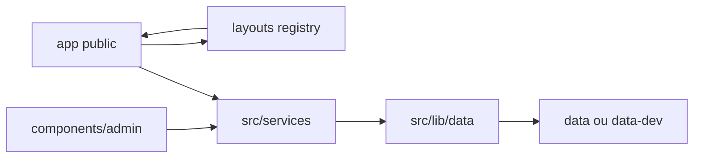
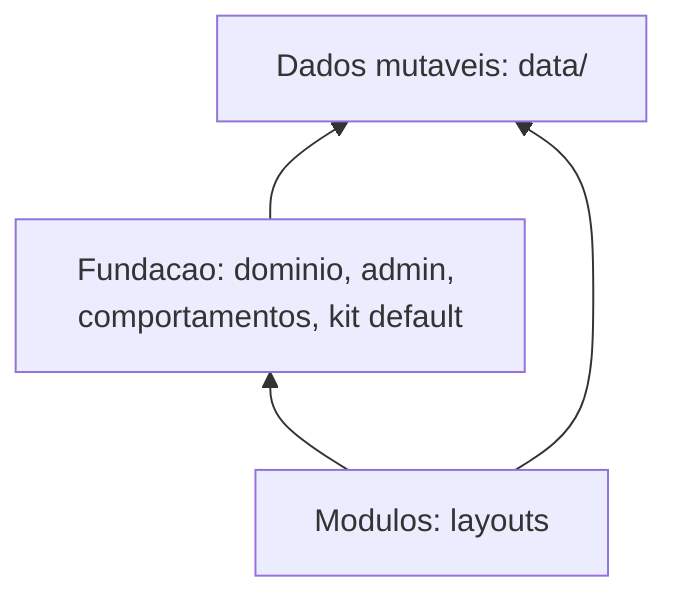
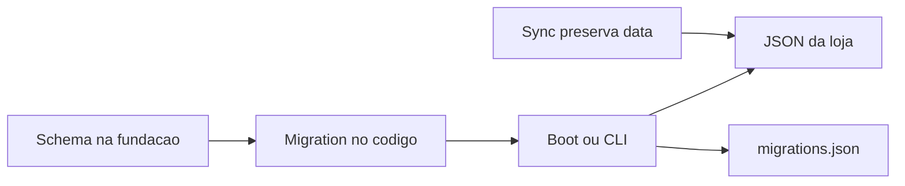

# Reorganização de arquivos

Implementação passo a passo: [CHECKLIST.md](./CHECKLIST.md).

Relatório da organização atual do Vina e proposta de pastas para separar fundação, módulos de layout e dados mutáveis.

Este documento descreve o repositório como ele está e, na segunda parte, um destino de pastas. Não move código, CSS nem `data/`.

Critérios do destino:

- Semântica: cada arquivo tem um lugar previsível entre fundação, módulo e dados da loja.
- Leitura curta: quem abre uma feature encontra o que precisa na mesma pasta, sem carregar `globals.css` inteiro nem a gaveta `src/lib`.
- Contrato estável com o Next.js e com as lojas criadas a partir do template.

---

## Parte 1 — Organização atual

### O que o projeto é

O Vina é um catálogo para lojas que fecham pedido no WhatsApp. O mesmo repositório tem duas superfícies:

- **Vitrine pública** — home, catálogo, produto, carrinho, sobre.
- **Painel admin** — produtos, categorias, pedidos, clientes, dashboard e personalização (marca, textos, tema, layout, navegação, WhatsApp, contato).

Não há banco separado. A loja vive em JSON e mídia dentro de `data/`. Em desenvolvimento o processo lê e grava `data-dev/`. Em produção, com `DATA_BACKEND=github`, o admin commita de volta em `data/` pela API do GitHub.

Cada loja de cliente é um repositório criado com **Use this template**. O cliente edita `data/`. O workflow [`.github/workflows/sync.yml`](../../../.github/workflows/sync.yml) aplica a árvore de `upstream/main` e devolve `data/` ao estado do cliente (`git read-tree` + `git checkout` de `data`). Código fora de `data/` que o cliente altere é sobrescrito no próximo sync.

### Restrições que a árvore já obedece

| Restrição | Onde aparece |
|-----------|----------------|
| `data/` na raiz do repositório, único namespace preservado no sync | `sync.yml`; `dataRepoPath()` em [`src/lib/data/paths.ts`](../../../src/lib/data/paths.ts) prefixa sempre `data/` |
| `data-dev/` é cópia local, gitignored, usada quando `NODE_ENV=development` | `DATA_DIR_NAME` em `paths.ts`; scripts `dev:restore:data` / `dev:reset:data` |
| App Router na raiz `app/` | páginas, layouts, rotas `api/`, `media/` |
| Código não entra em `data/`; dado da loja não sai de `data/` | [`docs/configurar-template-loja.md`](../../configurar-template-loja.md) |

`getDataRoot()` ainda aceita `VINA_DATA_ROOT` para CLI e testes. Isso não muda o prefixo Git: o adapter do GitHub grava sob `data/`.

### Mapa da raiz

Contagem aproximada de fontes (sem `node_modules`, `.next`, `data-dev`): ~142 arquivos TypeScript em `src/`, ~176 em `components/` (tsx/css), ~68 em `app/`.

```
.
├── app/                  casca Next: rotas, layouts, API, CSS global, ícones
├── components/           UI admin, vitrine e primitivos
├── src/                  domínio: schemas, services, acesso a dados, comportamentos
├── data/                 seed versionado + conteúdo da loja em produção
├── data-dev/             workspace local (gitignored)
├── public/               assets estáticos do scaffold Next; mídia da loja não fica aqui
├── scripts/              restore/seed, migrations, índices, validação de copy
├── docs/                 personalização, template de loja, este relatório
├── middleware.ts         sessão em /admin e /api/v1/admin; redirects legados de catálogo
├── instrumentation.ts    migrations de JSON no startup Node
├── next.config.ts        imagens /media, stub de migration no Edge, rewrite do favicon
└── vercel.json           framework nextjs
```

`public/` quase não participa da loja. Imagens de produto, banner e site ficam em `data/imagens/` e saem pela rota `app/media/[...path]`.

### `app/` — casca de composição

As rotas são finas: buscam dados e entregam a um componente. A lógica de negócio não mora aqui.

| Grupo | URL | Papel |
|-------|-----|--------|
| `(public)` | `/`, `/catalogo`, `/catalogo/page/[page]`, `/catalogo/busca`, `/produto/[slug]`, `/carrinho`, `/sobre` | Vitrine. Layout com Header/Footer do layout ativo. `revalidate = 120` |
| `admin/login` | `/admin/login` | Login, fora do shell do painel |
| `admin/(panel)` | `/admin`, produtos, categorias, clientes, pedidos, personalização | Painel. `banners/` redireciona: banners vivem na personalização |
| `api/v1` | ver abaixo | REST |
| `media/[...path]` | `/media/...` | Binário lido de `imagens/` via o adapter de dados |
| raiz | `layout.tsx`, `globals.css`, `layout-tokens.css`, `icon.tsx`, `not-found.tsx` | HTML, fontes, tema, 404 |

API pública: `products`, `products/[slug]`, `products/by-ids`, `categories`, `banners`, `site-config`, `clientes` (lead), `analytics`.

API de sessão: `auth/login`, `auth/logout`, `auth/me`.

API admin (cookie exigido pelo middleware): `admin/products`, `categories`, `banners`, `clientes`, `orders`, `site-config`, `uploads`, `dashboard`, `diagnostics`.

O shell público ([`app/(public)/layout.tsx`](../../../app/(public)/layout.tsx)) carrega site e categorias, chama `getLayout(site.layout)` e monta `Header` + `children` + `Footer` dentro de analytics, gate de WhatsApp e carrinho. A home ([`app/(public)/page.tsx`](../../../app/(public)/page.tsx)) pede só `Home` ao mesmo registry. Catálogo, produto, carrinho e sobre **não** passam pelo registry: herdam o chrome e o atributo `data-layout` no `<html>` / `<body>`.

### `src/` — fundação de domínio, ainda sem um critério único de pasta

```
src/
├── config/          defaults de site e copy (default-site-config, store-copy-defaults)
├── schemas/         contratos Zod
├── services/        CRUD e regras por entidade
└── lib/
    ├── data/        adapters fs e GitHub, commit, migrations
    ├── indices/     manifests e shards derivados
    ├── auth/        JWT e sessão (Node e Edge)
    ├── api/         erros e respostas HTTP
    ├── cache/       leituras ISR da vitrine
    ├── front/       carrinho, preço, mídia, tema CSS, copy, facetas
    ├── admin/       multipart, revalidate, rótulos de campo
    ├── br/          endereço e ViaCEP
    └── *.ts         arquivos soltos: wa-*, navigation*, slug, csv, pagination, env, …
```

#### Schemas

Contratos por entidade: produto, categoria, banner, pedido, cliente, navegação, site, analytics, dashboard e índices. O enum de layout é fechado em [`src/schemas/site-config.ts`](../../../src/schemas/site-config.ts):

```ts
export const siteLayoutSchema = z.enum(["classic", "split", "gallery", "atelie"]);
export type SiteLayoutId = z.infer<typeof siteLayoutSchema>;
```

Abas de personalização apontam para arquivos relativos à raiz de dados:

| Aba | Arquivo |
|-----|---------|
| geral | `configuracoes/geral.json` |
| whatsapp | `configuracoes/whatsapp.json` |
| contato | `configuracoes/contato.json` |
| vitrine | `configuracoes/vitrine.json` |
| navegacao | `configuracoes/navegacao.json` |
| textos | `configuracoes/textos.json` |
| tema | `configuracoes/tema.json` |

`meta.json` guarda `versao` e `atualizadoEm` (lock otimista compartilhado entre abas). O detalhe de fragmentos e migrations está em [`docs/personalizacao.md`](../../personalizacao.md).

O barrel [`src/schemas/index.ts`](../../../src/schemas/index.ts) reexporta `common`, `product`, `category`, `banner`, `site-config` e `client`. Pedido, navegação, índices, abas e dashboard ficam de fora. [`src/schemas/site-config-tabs.ts`](../../../src/schemas/site-config-tabs.ts) (~470 linhas) mistura paths, Zod e split/merge dos fragmentos.

#### Services

| Service | Pasta relativa em `data/` |
|---------|---------------------------|
| `products.service` | `produtos/` |
| `categories.service` | `categorias/` |
| `banners.service` | `banners/` |
| `orders.service` | `pedidos/` |
| `clients.service` | `clientes/` |
| `site-config.service` | `configuracoes/*.json` (legado `site.json` só se os fragmentos ainda não existirem) |
| `upload.service` | `imagens/{produtos,banners,site}/` |
| `analytics.service` | `analytics/daily/` |
| `dashboard.service` | agrega índices |

[`src/services/index.ts`](../../../src/services/index.ts) não reexporta `orders` nem `analytics`. Quem precisa importa o arquivo direto.

#### Acesso a dados

`src/lib/data/` escolhe o adapter: `fs` no disco, `github` na API do GitHub. Em development o backend é sempre `fs` + `data-dev/`, e `DATA_BACKEND` é ignorado.

Escrita típica: service monta `FileChange[]` → `commitFiles` (fs atômico ou commit GitHub) → `revalidateStorefront`. Migrations rodam no startup (`instrumentation.ts`) e no CLI `npm run data:migrate`. O ledger fica em `configuracoes/migrations.json`.

Índices (`src/lib/indices/`) são derivados: `indices/produtos.json`, `produtos-by-slug.json`, `produtos-by-categoria.json`, `produtos-by-referencia.json`, `dashboard-catalogo.json`, `pedidos.json`, `clientes.json`, `clientes-by-email.json`, `clientes-by-celular.json`. Não são fonte de verdade; reconstruem-se a partir das entidades.

#### Comportamentos fora de uma pasta de domínio

Em `src/lib/` na raiz, sem subpasta:

- WhatsApp: `wa.ts`, `wa-cart-template.ts`, `wa-product-template.ts`, `wa-compact-template.ts`, `wa-template-validation.ts`, `wa-whatsapp-normalize.ts`
- Navegação: `navigation.ts` (resolve a vitrine), `navigation-admin.ts` (edição), mais `schemas/navigation.ts` (contrato)
- Utilitários transversais: `slug.ts`, `pagination.ts`, `csv.ts`, `rate-limit.ts`, `env.ts`, `instagram.ts`, `categories-tree.ts`, `product-referencia.ts`, `dashboard-aggregates.ts`, `analytics-date.ts`, `cache-tags.ts`

`src/lib/front/` guarda o que a vitrine executa no cliente ou no render: carrinho, preço, variantes, mídia, facetas, copy, tema em CSS variables, breakpoints 768/1024.

### `components/` — UI

```
components/
├── ui/                 primitivos usados pelo admin e pela vitrine (paginação, voltar ao topo)
├── admin/              painel
│   ├── configuracoes/  personalização, fatiada por aba (+ navegacao/)
│   ├── dashboard/      painéis e sections
│   └── *.tsx           shells e forms soltos na raiz da pasta
└── public/             vitrine
    ├── analytics/      consentimento e provider
    ├── cart/           provider, toast, página, botão do header
    ├── icons/
    ├── layouts/        registry + classic, split, gallery, atelie
    └── *.tsx           catálogo, PDP, marca, WhatsApp, rodapé compartilhado
```

#### Admin

Páginas em `app/admin/(panel)` delegam para um client:

| Rota | Componente |
|------|------------|
| `/admin` | `DashboardClient` → `dashboard/` |
| `/admin/personalizacao` | `PersonalizacaoClient` → painéis em `configuracoes/` |
| produtos | `ProductForm`, galeria, variantes, exclusão |
| categorias | `CategoriasClient` |
| clientes | `ClientesClient` |
| pedidos | `PedidosClient`, `PedidoForm` |

`configuracoes/` e `dashboard/` já são pastas de feature. O resto da UI admin está flat na raiz de `components/admin`: `ProductForm.tsx`, `PedidoForm.tsx`, `CategoriasClient.tsx`, `ClientesClient.tsx`, `mutationFetch.ts`, `uploadClient.ts`, sidebar, toasts, dialogs.

`NavegacaoEditor.tsx` (~516 linhas) fica nessa raiz, enquanto CSS e subcomponentes estão em `components/admin/configuracoes/navegacao/`.

O shell do painel (`AdminSidebar`, classes `admin-shell`) usa `globals.css`, não um CSS module da pasta.

#### Vitrine compartilhada (fora de um layout)

Na raiz de `components/public/`: `CatalogPageView`, `CatalogFilters`, `CategoryNav`, `ProductCard`, `ProductDetailClient`, `ProductGallery`, `ProductVariantPicker`, `ProductQuantityStepper`, `BannerSlots`, `StoreBrand`, `PublicFooterSections`, `footerContact`, `FooterSocialLinks`, `WhatsAppButton`, `WhatsAppGateProvider`, `InstagramButton`, `ClientLeadModal`, `SiteChrome` (aponta para o classic).

Esses arquivos servem todas as lojas. O layout ativo muda a aparência deles sobretudo por classes globais e por `body[data-layout="…"]`, não por um componente próprio do layout.

`components/ui/` é transversal de verdade: paginação usada no dashboard, pedidos, clientes e no catálogo público.

### Módulos de layout — o que já existe

Registry em [`components/public/layouts/registry.tsx`](../../../components/public/layouts/registry.tsx): `classic`, `split`, `gallery`, `atelie`. Id desconhecido cai em `classic`.

Contrato atual em [`components/public/layouts/types.ts`](../../../components/public/layouts/types.ts):

```ts
export type SiteLayoutModule = {
  id: SiteLayoutId;
  Header: (props: ChromeProps) => ReactNode;
  Footer: (props: ChromeProps) => ReactNode;
  Home: (props: HomeProps) => ReactNode;
  NotFound: (props: NotFoundProps) => ReactNode;
};
```

`ChromeProps` recebe `site` + `categories`. `HomeProps` recebe também banners, destaques, novidades, fallback da vitrine e o número de WhatsApp. O módulo não busca arquivo nem chama service.

| Layout | O que possui | O que importa de fora |
|--------|----------------|------------------------|
| classic | Header, Footer, Home, NotFound, `classic.module.css` | `BannerSlots`, `ProductCard`, `StoreBrand`, `PublicFooterSections`, WhatsApp/Instagram, `CartHeaderButton`, `PublicMobileNav`, `headerNav`, helpers de mídia em `src/lib/front` |
| split | o mesmo + `FootMark.tsx`, `split.module.css` | o mesmo conjunto; busca no header é própria do split |
| gallery | o mesmo + `GalleryCarousel.tsx`, `gallery.module.css` | `ProductCard` e chrome compartilhado; home usa carrossel em vez das faixas de banner |
| atelie | Header decomposto em `header/` (marca, nav, menu, sacola, fonte Cormorant, breakpoints 1100, CSS module). Home, Footer e NotFound ainda são stubs | `CartHeaderButton`, `headerNav`, `mediaUrl`, tipos de navegação. Sem bloco `[data-layout="atelie"]` em `layout-tokens.css`. `LAYOUT_BANNER_SLOTS.atelie` é lista vazia |

Metadados do módulo, usados pelo admin: `layouts/options.ts` (cards de escolha) e `layouts/banner-slots.ts` (slots de banner por layout).

Para acrescentar um layout hoje é preciso alterar, no mínimo: o enum Zod, o registry, `options`, `banner-slots`, e o CSS global se a pele de catálogo/PDP/carrinho for diferente. O preview da vitrine no admin reimplementa heróis de classic, split e gallery.

### CSS

| Arquivo | Tamanho | Conteúdo |
|---------|---------|----------|
| [`app/globals.css`](../../../app/globals.css) | 8144 linhas | Base da vitrine, chrome admin (a partir da linha ~1847, milhares de linhas), modal de lead, skeletons, carrinho, pele `body[data-layout="gallery"]` no catálogo/PDP/sobre (a partir da linha ~7824), toasts |
| [`app/layout-tokens.css`](../../../app/layout-tokens.css) | 333 linhas | Variáveis `--vn-layout-*` em `:root` / classic, split e gallery. Ateliê não tem bloco |
| CSS modules | por componente | chrome e home de cada layout; vários painéis admin; alguns widgets (`CategoryNav`, `StoreBrand`, `ConsentBanner`, `PublicMobileNav`, header do ateliê) |

Tema do lojista (cores, raio, container) não está nesses arquivos: `src/lib/front/site-theme-css.ts` injeta variáveis `--vn-*` no layout raiz. Fontes padrão (Poppins, Inter, Bebas Neue) vêm de `next/font` em `app/layout.tsx`. A Cormorant do ateliê é arquivo local em `layouts/atelie/header/fonts/`.

Catálogo, PDP e carrinho estilizam com classes globais (`.catalog-page`, `.card-product`, `.product-detail`, …). Um layout novo que queira outra pele precisa editar `globals.css` ou `layout-tokens.css`, fora da pasta do layout.

### `data/` — instância da loja

O seed versionado espelha o runtime. Entidades vazias no template usam `.gitkeep`. Configuração e índices já vêm preenchidos.

```
data/
├── produtos/            um JSON por produto
├── categorias/
├── banners/
├── pedidos/
├── clientes/
├── configuracoes/       geral, whatsapp, contato, vitrine, navegacao, textos, tema, meta, migrations
├── indices/             derivados (listagens e lookups)
├── imagens/
│   ├── produtos/
│   ├── banners/
│   └── site/
└── analytics/
    └── daily/
```

`data-dev/` repete essa árvore no computador. `npm run dev:restore:data` copia `data/` → `data-dev/`. `dev:reset:data` limpa e restaura o seed. `dev:seed` acrescenta um catálogo grande para exercitar o dashboard.

Quem escreve: services do admin (e o upsert público de lead/analytics), sempre pelo adapter. Quem lê a vitrine: services + cache ISR (`getCachedSiteConfig`, categorias, produtos), invalidado no save por `revalidateStorefront`. TTL de 120s é rede de segurança.

### Fluxo entre as três ideias (como está hoje)



A fundação (`src/schemas`, `src/services`, `src/lib/data`) é o único caminho até o disco. Os layouts desenham com props já carregadas. O admin grava fragmentos de `configuracoes/` e entidades. A vitrine lê o mesmo contrato.

O acoplamento que foge desse desenho é visual: layouts e páginas públicas dependem de classes em `globals.css`, e três layouts dependem dos mesmos componentes soltos em `components/public/`.

### Migrations — schema da fundação sobre o JSON da loja

O código que transforma dados fica na fundação. O JSON transformado e o registro do que já rodou ficam nos dados mutáveis.

**Código.** O pacote é [`src/lib/data/migrations/`](../../../src/lib/data/migrations/). O contrato em [`types.ts`](../../../src/lib/data/migrations/types.ts) tem `id`, `order` e `run`, que devolve uma lista de `FileChange`. O registry em [`registry.ts`](../../../src/lib/data/migrations/registry.ts) é a lista ordenada:

| `order` | `id` |
|---------|------|
| 10 | `2026-07-production-baseline` |
| 20 | `2026-07-split-site-config-by-tab` |
| 30 | `2026-07-merge-geral-config-tab` |

O runner acrescenta `2026-07-indices-repair` (`order` 90), definido em [`src/lib/indices/repair-all.ts`](../../../src/lib/indices/repair-all.ts). `id` e `order` são únicos: o registry interrompe o load se algum se repetir.

**Ledger.** `configuracoes/migrations.json` guarda `schemaVersion` e `applied[id].appliedAt`. O escritor é o runner ([`state.ts`](../../../src/lib/data/migrations/state.ts)). Esse arquivo registra execução; a transformação continua no código.

**Quando roda.** No startup do runtime Node, por [`instrumentation.ts`](../../../instrumentation.ts), e no CLI `npm run data:migrate`. O runtime Edge usa um stub e não migra.

**Loja que já existe.** O sync aplica o código novo e devolve o `data/` do cliente como estava, ledger incluído. A migration nova chega com o código e roda no boot seguinte, sobre o JSON antigo. O seed de `data/` no repo base vale para loja nova; a loja que já tem o próprio `data/` só avança pela migration.

**Idempotência e validação.** `fileChangeIfMigrated` deixa o arquivo de fora quando o JSON já está na forma nova. [`validate.ts`](../../../src/lib/data/migrations/validate.ts) confere o conteúdo contra o Zod vigente antes do commit; o ledger, os índices e o analytics ficam fora dessa checagem. Um lock `__data_migrations__` serializa a execução, com nova tentativa em `VERSION_CONFLICT` e `REF_CONFLICT`. Os arquivos da entidade entram num commit; o ledger entra no commit seguinte. Se o processo parar entre os dois, a migration roda outra vez, e o `run` precisa produzir o mesmo resultado.

### O que já está coerente

- Separação `app/` (rotas) / `components/` (UI) / `src/` (domínio) / `data/` (instância).
- Um service por entidade, paths relativos à raiz de dados, prefixo `data/` só na fronteira Git.
- Registry de layout com contrato pequeno e explícito para chrome e home.
- Personalização e dashboard já em pastas de feature.
- Ateliê como ensaio de módulo mais fechado: fonte, breakpoints e CSS do header dentro da pasta.
- Migrations de JSON com ledger, em vez de editar seed de lojas antigas à mão.

### O que encarece a leitura

Estes pontos obrigam a abrir arquivos grandes ou várias pastas para entender uma única mudança.

1. **`globals.css` monolítico (8144 linhas).** Admin, vitrine, carrinho e a pele gallery estão no mesmo arquivo. Abrir o header do ateliê não deveria exigir esse contexto; hoje a pele de catálogo/PDP mora lá.
2. **Contrato de layout curto demais para a autonomia visual.** Header, Footer, Home e NotFound são plugáveis. Catálogo, PDP, carrinho e sobre são únicos e layout-aware só via CSS global. Um layout não consegue desenhar essas telas sem editar a fundação visual.
3. **Kit implícito.** `ProductCard`, `headerNav`, `PublicMobileNav`, `PublicFooterSections` e `BannerSlots` são imports estáveis dos layouts, mas vivem fora da pasta do módulo e fora de um kit nomeado. Não há como ver, num só lugar, o que é opcional e o que é obrigatório.
4. **Admin flat ao lado de features fatiadas.** Trabalhar em produtos abre a raiz de `components/admin` inteira (forms, clientes, pedidos, upload, toasts). `NavegacaoEditor` está separado dos arquivos de `configuracoes/navegacao/`.
5. **`src/lib` mistura papéis.** Adapters, índices e auth têm pasta. WhatsApp, navegação, slug, CSV e paginação estão soltos. `front/` agrupa coisas da vitrine que também são comportamento de domínio (preço, copy, carrinho).
6. **Barrels parciais.** `services/index.ts` e `schemas/index.ts` parecem a API pública e omitem pedido, analytics, navegação e índices. O import honesto é o caminho do arquivo.
7. **Navegação em três módulos** com nomes próximos: schema, resolução da vitrine, edição no admin.
8. **Breakpoints duplicados.** `src/lib/front/breakpoints.ts` (768/1024) e `layouts/atelie/header/breakpoints.ts` (1100). O segundo é local de propósito; o risco é o CSS global continuar no primeiro enquanto o módulo usa o outro.
9. **Enum de layout fechado no schema de site.** O id do módulo é dado da loja (`configuracoes` / `layout`) e também lista compilada no código. Isso é esperado enquanto os layouts shipam no repo base, e precisa continuar explícito: módulo novo é mudança de fundação (o enum) mais a pasta do módulo.

---

## Parte 2 — Proposta

### Três camadas

A organização alvo nomeia três papéis. A dependência de código aponta para a fundação. Os dados não importam código.



**Fundação.** O que toda loja compartilha: estruturas, validação, serviços, adapters, índices, auth, comportamentos (carrinho, WhatsApp, preço, navegação, copy, tema como dados) e o painel admin. Também entra aqui o **kit default** da vitrine: a implementação visual usada quando um layout não substitui uma superfície. Admin configura a loja; não é um layout.

**Módulos.** Um layout é um pacote com autonomia de composição e de CSS. Ele consome um modelo de leitura estável (site, categorias, produtos, banners, textos, estado de carrinho) e desenha as superfícies que quiser. Pode importar o kit. Não importa outro layout. Não lê disco nem chama service.

**Dados mutáveis.** A instância da loja em `data/` (e a cópia `data-dev/`). Produtos, pedidos, clientes, imagens, configuração e índices. O admin e, em poucos casos, a vitrine (lead, analytics) escrevem por meio da fundação. Cada layout exibe os mesmos dados com composição diferente.

`app/` não é uma quarta camada. Continua sendo a casca que o Next.js exige: rotas finas que leem a fundação e delegam ao módulo ativo ou ao kit.

### O que permanece no lugar

- `data/` e `data-dev/` na raiz, com a mesma árvore de entidades. O sync e `dataRepoPath()` não mudam.
- `app/` na raiz, com os mesmos segmentos de URL (`(public)`, `admin`, `api/v1`, `media`).
- Alias `@/` e a divisão geral domínio em `src/`, UI em `components/`.
- Enum `SiteLayoutId` no schema de site: o id escolhido no admin continua sendo dado da loja, e a lista de layouts shipados continua no código do base.

### Árvore alvo

Pastas, sem listar arquivo por arquivo. Itens novos estão marcados; o resto é agrupamento do que já existe.

```
app/                                  casca Next (permanece)
  (public)/                           rotas finas: dados + superfície do layout ou do kit
  admin/                              páginas finas do painel
  api/  media/  icon.tsx  sitemap.ts  robots.ts
  layout.tsx                          fontes padrão, data-layout, CSS mínimo
  styles/
    reset.css                         o que hoje abre globals.css e vale para todo documento
    theme-bridge.css                  só o gancho das variáveis --vn-* injetadas em runtime

src/
  schemas/                            contratos Zod (já está no lugar certo)
  services/                           um service por entidade
  foundation/
    data/                             hoje src/lib/data (adapters, commit, paths)
      migrations/                     registry ordenado + um arquivo por id; cada uma declara targets
    indices/                          hoje src/lib/indices
    auth/                             hoje src/lib/auth
    http/                             hoje src/lib/api
    cache/                            hoje src/lib/cache + cache-tags
    admin/                            hoje src/lib/admin (revalidate, multipart, rótulos)
    behaviors/
      whatsapp/                       wa.ts e wa-*
      navigation/                     navigation.ts + navigation-admin.ts
      catalog/                        facetas, árvore de categorias, referência, paginação de lista
      pricing/                        hoje front/pricing e variants
      cart/                           regras de carrinho (hoje front/cart)
      copy/                           store-copy e defaults usados pela vitrine
      theme/                          site-theme-css (dados de tema → variáveis)
      media/                          media, media-image, mediaUrl
    platform/                         slug, csv, rate-limit, env, endereço BR, instagram
  config/                             defaults de site (permanece)

components/
  ui/                                 primitivos sem domínio de loja (paginação, voltar ao topo)
  admin/
    shell/                            sidebar, toaster, login, dialogs, page actions
    produtos/                         ProductForm, galeria, variantes, listagem
    categorias/
    clientes/
    pedidos/
    personalizacao/                   hoje configuracoes/ + NavegacaoEditor
    dashboard/
    http/                             mutationFetch, uploadClient
  public/
    kit/                              implementação default, opcional para o layout
      catalog/                        CatalogPageView, filtros, CategoryNav
      product/                        ProductCard, PDP, galeria, variantes, quantidade
      cart/                           página e ações; provider pode ficar no shell de app
      chrome/                         StoreBrand, footer sections, BannerSlots, headerNav, mobile nav
      feedback/                       WhatsApp, Instagram, lead modal, consent
    layouts/
      contract/                       types, registry, options, banner-slots
      classic/                        componentes, CSS, tokens do classic
      split/
      gallery/
      atelie/                         header já local; home/footer/404 e tokens passam a morar aqui

data/                                 inalterado
data-dev/                             inalterado
scripts/  docs/  public/              inalterados na função
```

`src/lib/` deixa de ser destino de arquivo novo. Durante a migração vira fachada de reexport (`src/lib/data` → `src/foundation/data`) até os imports antigos acabarem. A fachada some numa fase final, não na primeira.

### Fundação

Responsabilidade: definir o que existe e como se comporta, independente do visual de um layout.

- **Schemas e services** ficam onde estão. O barrel passa a exportar o conjunto real (incluindo pedido e analytics) ou é removido, para o caminho do arquivo ser a API. `site-config-tabs.ts` separa paths/tipos do parse de fragmentos quando for mexido; não é pré-requisito das outras fases.
- **Behaviors** agrupam o que hoje está solto ou dentro de `front/` e é regra, não pixel. Preço, montagem da mensagem de WhatsApp, resolução de menu e copy vêm daqui. Um layout chama esses helpers ou recebe o resultado já pronto nas props.
- **Admin** é fundação de produto. A UI deixa a raiz flat e segue o recorte que `personalizacao/` e `dashboard/` já mostram: uma pasta por área do painel, com o CSS module ao lado do componente. `NavegacaoEditor` entra em `personalizacao/navegacao/`.
- **Kit default** é fundação visual. É o catálogo, o PDP e o carrinho de hoje, movidos para `components/public/kit/`. Continuam funcionando para classic, split e gallery no primeiro momento. Um layout novo não é obrigado a importá-los.

O admin pode conhecer o **contrato** dos layouts (`options`, slots de banner, id). Isso é configuração de módulo. O admin não importa componentes internos de `atelie/` ou `gallery/` para montar o painel. O preview da vitrine, se precisar imitar um herói, usa o próprio componente `Home` do módulo ou um slot de preview declarado no contrato — não uma segunda implementação dentro de `VitrinePreview`.

### Módulos de layout

O contrato cresce por superfícies opcionais. As quatro atuais continuam obrigatórias, para todo layout ter chrome, home e 404.

```ts
type SiteLayoutModule = {
  id: SiteLayoutId;
  Header: (props: ChromeProps) => ReactNode;
  Footer: (props: ChromeProps) => ReactNode;
  Home: (props: HomeProps) => ReactNode;
  NotFound: (props: NotFoundProps) => ReactNode;
  CatalogPage?: (props: CatalogPageProps) => ReactNode;
  ProductDetail?: (props: ProductDetailProps) => ReactNode;
  CartPage?: (props: CartPageProps) => ReactNode;
  AboutPage?: (props: AboutPageProps) => ReactNode;
};
```

A rota em `app/(public)` resolve assim: se o módulo exportar a superfície, renderiza a do módulo; senão, renderiza a do kit. Classic pode seguir no kit por um tempo. Ateliê pode substituir catálogo e PDP sem editar classic.

Props são modelo de leitura, montado na rota (server) a partir de services e cache:

- site (textos, tema, navegação, comportamento, layout id)
- categorias já filtradas para a vitrine
- lista ou detalhe de produto já no formato de leitura
- banners do slot pedido
- textos e rótulos já resolvidos (`store-copy`)
- href de WhatsApp já montado, quando a superfície só precisa do link

O módulo não chama `products.service` nem `readJson`. Se faltar dado para uma composição, o buraco é do modelo de leitura na fundação, não um import de service dentro do layout.

CSS do módulo fica na pasta do módulo:

- `classic/classic.css` (ou modules, como já é o chrome) recebe os tokens `--vn-layout-*` que hoje estão em `layout-tokens.css` sob `[data-layout="classic"]`.
- O mesmo para split, gallery e atelie.
- Overrides `body[data-layout="gallery"]` saem de `globals.css` e entram em `gallery/`.
- Fonte local, como a Cormorant, continua ao lado do layout que a usa.

`globals.css` encolhe para reset, tipografia base e o pouco que é estrutural do documento (skip link, foco). Chrome do admin vai para `components/admin/shell/`. Carrinho default vai para `kit/cart/`. Modal de lead e consent vão para `kit/feedback/`.

Autonomia dinâmica, com limite claro:

- O layout escolhe marcação, classe e CSS.
- O layout pode ignorar o kit e desenhar cartão, grade e PDP do zero.
- O layout usa os mesmos ids de layout, slots de banner e chaves de `textos` / `rotulos`. Inventar campo de `data/` dentro do módulo quebra o sync e o schema.
- Layouts não se importam. Semelhança entre classic e split é cópia consciente ou uso do kit, não `import "../classic"`.

Breakpoints de um layout ficam na pasta dele quando forem diferentes do default da fundação. O default (768/1024) permanece em `foundation` ou no kit e é o contrato do CSS compartilhado. O 1100 do ateliê permanece local.

### Dados mutáveis

A árvore de `data/` permanece. O documento de destino só fixa o contrato, para a fundação e os módulos não ganharem um segundo lugar de persistência.

| Caminho | Papel | Quem escreve | Quem lê |
|---------|--------|--------------|---------|
| `produtos/`, `categorias/`, `banners/`, `pedidos/`, `clientes/` | fonte de verdade, um JSON por entidade | service admin correspondente | service + cache da vitrine |
| `configuracoes/*.json` | site por aba; `meta.json` é a versão | `site-config.service` | vitrine inteira e painel |
| `configuracoes/migrations.json` | ledger | runner de migrations | runner |
| `imagens/{produtos,banners,site}/` | binário | `upload.service` | rota `/media` e campos de mídia nos JSON |
| `indices/` | derivado | mutate/rebuild de índices no mesmo commit da entidade | listagens, dashboard, lookup por slug/telefone |
| `analytics/daily/` | eventos | `analytics.service` (vitrine) | dashboard |

Regras:

- Path relativo nos services, sem prefixo `data/`. O prefixo existe só em `dataRepoPath` e no adapter GitHub.
- Índice não se edita no admin como entidade. Ele acompanha a mutação ou é reconstruído por script.
- Layout e kit leem dados só pelas props. Upload e caminho de imagem passam por `mediaUrl` (fundação), que conhece `/media`.
- `data-dev/` é o mesmo contrato no disco local. Script de restore continua copiando a árvore inteira.

### Migrations entre fundação e dados mutáveis

A migration é o elo entre uma mudança de estrutura na fundação e o JSON que cada loja já tem. O sync preserva `data/`; o boot (ou o CLI) aplica o que o ledger ainda não marcou.



Papéis:

- A fundação define o schema e entrega a migration que leva o JSON antigo até esse schema.
- Os dados mutáveis são o alvo e o ledger. O ledger lista o que já rodou nesta loja. A transformação permanece no código.
- O layout não cria migration. Um campo de configuração exigido por um layout entra no schema da fundação, com default. Se a forma gravada mudar, a migration acompanha o schema.

| Mudança na fundação | O que segue no mesmo conjunto |
|---------------------|-------------------------------|
| Campo novo com default no Zod, e a leitura tolera a ausência | Atualizar o seed. Migration quando o campo precisa estar gravado nas lojas antigas |
| Renomear, fatiar, fundir, remover ou mudar o tipo | Schema, migration com `order` maior que o último, e seed já na forma nova |
| Índice | Rebuild no mesmo fluxo. O repair de índices já é uma migration. O shard não se edita à mão |
| Layout novo | Enum e pasta do módulo. Migration se `configuracoes/` ganhar campo sem default seguro |

No destino de pastas, o pacote fica assim:

```
src/foundation/data/migrations/
  registry.ts          lista única ordenada
  <id>.ts              uma migration por arquivo
```

A ordem é global. Uma migration pode gravar em várias pastas de `data/` no mesmo passo, então os arquivos ficam por `id`, não por entidade. Cada migration declara `targets` (`produtos`, `categorias`, `banners`, `pedidos`, `clientes`, `configuracoes`, `imagens`, `indices`, `analytics`): a lista mostra o que ela pode gravar sem abrir o `run`.

O runner de hoje permanece até a mudança de pasta. `targets` entra junto com a ida para `src/foundation/data/migrations/`. O ledger continua em `data/configuracoes/migrations.json`, e na loja o runner segue como único escritor.

### Dependências permitidas

| De | Para | Permitido |
|----|------|-----------|
| `app/` | services, cache, `getLayout`, kit | sim |
| layout | schemas (tipos), behaviors puros, kit | sim |
| layout | outro layout, `src/foundation/data`, `fs` | não |
| kit | schemas, behaviors, `components/ui` | sim |
| kit | pasta de um layout | não |
| admin | services, schemas, contrato de layout (`options`, slots, tipo do módulo) | sim |
| admin | componente interno de um layout | não |
| service | schemas, foundation/data, indices | sim |
| service | `components/` | não |
| `data/` | qualquer código | não |

Carrinho no cliente: o provider pode continuar no shell de `app/(public)/layout.tsx`, porque é comportamento da fundação (ligar ou desligar `mostrarCarrinho`) e não visual. O botão e a página é que são superfície: kit ou override do layout.

### Onde nasce um arquivo novo

| Se o arquivo… | Vai para |
|---------------|----------|
| valida ou descreve JSON da loja | `src/schemas/` |
| lê ou grava uma entidade | `src/services/<entidade>.service.ts` |
| adapta disco, GitHub, índice, sessão, HTTP | `src/foundation/<área>/` |
| transforma JSON antigo para o schema novo | `src/foundation/data/migrations/<id>.ts`, registrada em `registry.ts` |
| calcula preço, mensagem de WhatsApp, menu, copy, tema | `src/foundation/behaviors/<área>/` |
| é tela do admin | `components/admin/<feature>/` |
| é visual default da vitrine, usado se o layout não substituir | `components/public/kit/<superfície>/` |
| é visual de um layout específico | `components/public/layouts/<id>/` |
| é primitivo sem noção de loja | `components/ui/` |
| é página, route handler ou layout Next | `app/` correspondente, fino |
| é JSON, imagem ou índice da loja | `data/` (e passa a existir em `data-dev/` pelo fluxo de restore/seed) |

Teste fica ao lado do arquivo que cobre, como já ocorre em `src/`.

### Leitura e tokens

O ganho vem de cortar arquivos que misturam assuntos, não de multiplicar cópias.

- Trabalhar no header do ateliê abre `layouts/atelie/`, não as 8144 linhas de `globals.css` nem o classic.
- Trabalhar em produtos abre `components/admin/produtos/` e `products.service`, não pedidos e clientes.
- Um layout que só muda CSS de catálogo edita o CSS da própria pasta e as props de `CatalogPage`. Não relê o adapter GitHub.
- O kit existe uma vez. Quatro cópias de `CatalogPageView` aumentariam o contexto de qualquer mudança de comportamento (filtro, paginação, lead). Override é opt-in por superfície.
- Barrels deixam de esconder metade da API. O import aponta para o arquivo do comportamento.

### Fases sugeridas

Cada fase é um trabalho futuro, independente deste documento. Nenhuma muda URL nem a árvore de `data/`.

1. **CSS e contrato opcional.** Fatiar `globals.css` e `layout-tokens.css` para as pastas de destino (admin shell, kit, cada layout), mantendo as classes atuais para não redesenhar. Acrescentar `CatalogPage`, `ProductDetail`, `CartPage` e `AboutPage` opcionais no `SiteLayoutModule`. As rotas usam o componente do layout se existir e, senão, o componente atual. Ateliê ganha o bloco de tokens na própria pasta, mesmo vazio.
2. **Pastas de feature no admin.** Mover forms e clients flat para `produtos`, `categorias`, `clientes`, `pedidos`, `shell`. Colocar `NavegacaoEditor` em `personalizacao/navegacao/`.
3. **Kit explícito.** Mover os componentes da raiz de `components/public/` para `kit/`. Ajustar imports dos layouts. Apagar `SiteChrome` se continuar só como alias do classic.
4. **`src/lib` → `foundation/`.** Mover com reexports temporários nos caminhos antigos, incluindo `src/lib/data/migrations` para `src/foundation/data/migrations/` (registry único e um arquivo por id). Cada migration ganha `targets`. Agrupar `wa-*` e os dois `navigation*`. Completar ou remover os barrels de `services` e `schemas`.
5. **Modelo de leitura.** As rotas públicas passam a montar props de superfície (catálogo, PDP, carrinho, sobre) num único módulo de view-model, para o layout não remontar textos, hrefs e listas ad hoc. Preview do admin passa a reutilizar `Home` (ou um slot de preview no contrato) em vez de reimplementar heróis.

A fase 1 já reduz o arquivo que mais custa contexto e destrava um layout desenhar catálogo e PDP sem esperar o resto da mudança de pastas.
