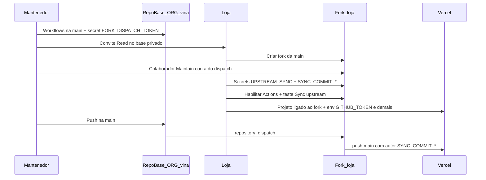

# Nova loja — do zero até o site no ar

Guia passo a passo para colocar uma loja no ar com **Vina**.

- **Mantenedor:** cuida do repositório **base** na organização GitHub (repo **privado**).
- **Loja:** cria o **fork**, configura GitHub Actions e publica na **Vercel**.

Substitua `ORG` pelo nome da organização do base (ex.: `minha-org`) e `vina` pelo nome do repositório, se for diferente.

---

## Antes de começar

| Termo | Significado |
|-------|-------------|
| **Repo base** | `ORG/vina` — código principal, privado, na org. |
| **Fork** | Cópia do base na conta ou org **da loja**. A Vercel usa o fork, não o base. |
| **PAT (token)** | Senha de API do GitHub. **Não** se cria dentro do repositório. Cria-se em [Developer settings → Personal access tokens](https://github.com/settings/personal-access-tokens) e depois **cola-se** no lugar certo. |

---

## Onde cada credencial nasce e onde colar

| Nome | Para quê | Quem **gera** (conta GitHub) | Onde **colar** |
|------|----------|------------------------------|----------------|
| `FORK_DISPATCH_TOKEN` | Avisar os forks para sincronizar depois de cada push na `main` do base | Conta **bot** ou **mantenedor** | **Só no repo base** → Settings → Secrets and variables → Actions |
| `UPSTREAM_SYNC_TOKEN` | O workflow no fork **lê** o base privado para trazer atualizações | **Loja** (recomendado) ou mantenedor | **Só no fork** → Actions secrets |
| `SYNC_COMMIT_NAME` | Nome do autor dos commits de sync | **Loja** — copiar do perfil (não é PAT) | **Só no fork** → Actions secrets |
| `SYNC_COMMIT_EMAIL` | E-mail do autor dos commits de sync | **Loja** — copiar do perfil (não é PAT) | **Só no fork** → Actions secrets |
| `GITHUB_TOKEN` | O painel admin em produção **grava** arquivos em `data/` no fork | **Loja** | **Só na Vercel** → Settings → Environment Variables |

**Importante:** a loja usa **dois PATs diferentes**. Um só **lê** o base (Actions). Outro só **escreve** no fork (Vercel). **Não** use o mesmo valor nos dois.

**Alinhar upstream:** o workflow de sync usa um `owner/repo` fixo (padrão em [sync-fork-reusable.yml](../.github/workflows/sync-fork-reusable.yml), campo `upstream_repo`). O repositório que você marcar no `UPSTREAM_SYNC_TOKEN` tem que ser **o mesmo** `ORG/vina` que o workflow usa. Se o default no código ainda for um nome antigo, ajuste o PAT **ou** peça ao mantenedor para corrigir o default no workflow.

---

## Ordem recomendada (visão geral)

Siga esta ordem. Pular um passo costuma gerar erro 403, fetch falho ou deploy que não dispara.



### Checklist por fase

**Fase 0 — Mantenedor (base, pode ser antes de existir fork)**

- [ ] Workflows de sync na `main` do base
- [ ] Conta bot/mantenedor definida para dispatch
- [ ] PAT `FORK_DISPATCH_TOKEN` criado e colado no **base**

**Fase 1 — Acesso e fork (mantenedor + loja)**

- [ ] Loja com **Read** no base privado
- [ ] Fork criado na conta/org da loja
- [ ] Conta do dispatch como **Maintain** no fork
- [ ] PAT de dispatch atualizado para incluir o novo fork (se fine-grained)

**Fase 2 — Fork (loja)**

- [ ] GitHub Actions habilitadas
- [ ] Secrets `UPSTREAM_SYNC_TOKEN`, `SYNC_COMMIT_NAME`, `SYNC_COMMIT_EMAIL`
- [ ] Teste manual: Actions → Sync upstream → Run workflow

**Fase 3 — Vercel (loja)**

- [ ] Projeto conectado ao **fork**, branch `main`
- [ ] Variáveis de ambiente (incluindo `GITHUB_TOKEN`)
- [ ] Deploy ok; admin grava produto → commit em `data/` no fork

**Fase 4 — Teste final (mantenedor + loja)**

- [ ] Push na `main` do base → sync no fork → deploy na Vercel

---

## Passo a passo detalhado

### Fase 0 — Configurar o repo base (mantenedor)

**1. Conferir workflows**

Abra o repo base no GitHub. A branch `main` deve ter:

- [sync-notify-forks.yml](../.github/workflows/sync-notify-forks.yml) — roda no **base** após push na `main`
- [sync-upstream.yml](../.github/workflows/sync-upstream.yml) — roda só no **fork**
- [sync-fork-reusable.yml](../.github/workflows/sync-fork-reusable.yml) — lógica compartilhada

**2. Escolher a conta do dispatch**

Use um usuário **bot** ou uma conta de mantenedor que você vai adicionar como **Maintain** em cada fork de loja.

**3. Criar e colar `FORK_DISPATCH_TOKEN`**

Veja a seção [Como criar o FORK_DISPATCH_TOKEN](#como-criar-o-fork_dispatch_token) abaixo.

1. Gere o PAT nessa conta.
2. Abra o **repo base** (não o fork).
3. **Settings → Secrets and variables → Actions → New repository secret**
4. Nome: `FORK_DISPATCH_TOKEN`
5. Cole o valor do token.

**4. (Opcional) Testar sem fork**

Faça um commit qualquer na `main` do base. O workflow **Notify forks to sync** pode rodar e o script listar “Nenhum fork encontrado”. Isso é normal.

---

### Fase 1 — Acesso ao base e criação do fork

**Mantenedor — dar acesso ao base privado**

1. No repo base: **Settings → Collaborators and teams** (ou gestão de acesso da org).
2. Convide o **usuário GitHub da loja** com permissão **Read** no repositório.

**Loja — aceitar e fazer o fork**

1. Aceite o convite no e-mail ou nas notificações do GitHub.
2. Abra o repo base `ORG/vina`.
3. Clique em **Fork**.
4. Destino: **sua conta** ou **org da loja**.
5. Deixe a branch **main** marcada.
6. (Opcional) Edite arquivos em `data/` no fork e dê push na `main`. Evite mudar `src/` sem necessidade — reduz conflitos na sincronização.

**Mantenedor — permitir sync imediato no fork**

1. Abra o **fork** da loja (não o base).
2. **Settings → Collaborators** → adicione a **mesma conta** usada no `FORK_DISPATCH_TOKEN`.
3. Papel: **Maintain**.

**Mantenedor — incluir o fork no PAT (fine-grained)**

Se o token fine-grained lista repositórios um a um, **edite o token** e inclua o fork novo. Sem escrita nesse repo, o dispatch falha com 403.

---

### Fase 2 — Secrets no fork (loja)

**1. Habilitar Actions**

1. Abra **seu fork**.
2. Aba **Actions**.
3. Se pedir, clique em **Enable workflows**.

**2. `UPSTREAM_SYNC_TOKEN`**

Veja [Como criar o UPSTREAM_SYNC_TOKEN](#como-criar-o-upstream_sync_token).

1. Gere o PAT (recomendado: **na sua conta**, com Read no base).
2. No fork: **Settings → Secrets and variables → Actions → New repository secret**
3. Nome: `UPSTREAM_SYNC_TOKEN`
4. Cole o token.

**Alternativa:** o mantenedor gera um PAT de serviço, guarda no cofre e cola no fork (ou envia uma vez por canal seguro). Detalhes: [sync-upstream-maintainer.md](sync-upstream-maintainer.md#upstream_sync_token-guardar-ou-repassar).

**3. `SYNC_COMMIT_NAME` e `SYNC_COMMIT_EMAIL`**

Use a **mesma conta GitHub** que vai importar o projeto na Vercel.

1. Nome: [Settings → Profile](https://github.com/settings/profile) → campo **Name**.
2. E-mail: [Settings → Emails](https://github.com/settings/emails) → e-mail **primary** (ou o noreply que a Vercel usa no deploy).
3. No fork, crie **dois** secrets de Actions com esses textos exatos.

**4. Testar sync**

1. **Actions → Sync upstream → Run workflow**.
2. Se falhar no fetch: confira `UPSTREAM_SYNC_TOKEN` e se o repo no PAT é o mesmo upstream do workflow.
3. Se passar: pode seguir para a Vercel (commits de sync só disparam deploy depois que a Vercel estiver ligada ao fork).

Mais detalhes do dia a dia: [sync-fork.md](sync-fork.md).

---

### Fase 3 — Vercel (loja)

**1. Criar o projeto**

1. [Vercel Dashboard](https://vercel.com) → **Add New Project**.
2. Conecte o GitHub e escolha o **fork** (nunca o base).
3. Production branch: **main**.
4. Use Node **22+** se o build pedir.

**2. Variáveis de ambiente**

Em **Settings → Environment Variables** (Production):

| Variável | Valor |
|----------|--------|
| `DATA_BACKEND` | `github` |
| `GITHUB_OWNER` | Dono do **fork** (usuário ou org da loja) |
| `GITHUB_REPO` | Nome do repo **fork** (ex.: `vina`) |
| `GITHUB_BRANCH` | `main` |
| `GITHUB_TOKEN` | PAT de escrita no **fork** — ver [Como criar o GITHUB_TOKEN para a Vercel](#como-criar-o-github_token-para-a-vercel) |
| `ADMIN_USERNAME` | Login do painel admin |
| `ADMIN_PASSWORD` | Senha forte do painel |
| `JWT_SECRET` | Texto aleatório com pelo menos 32 caracteres |
| `NEXT_PUBLIC_SITE_URL` | URL pública do site (ex.: `https://sua-loja.vercel.app`) |

**Não** coloque o `GITHUB_TOKEN` da Vercel nos secrets de Actions do fork (salvo se quiser duplicar de propósito — o app em produção usa só a Vercel).

**3. Deploy e teste**

1. Faça o deploy.
2. Abra a vitrine.
3. Entre no admin, salve um produto.
4. No GitHub do **fork**, deve aparecer um commit em `data/`.

---

### Fase 4 — Conferência ponta a ponta

**Mantenedor:** faça um push na **`main` do base** (pode ser commit pequeno).

**Loja:** observe:

1. No **base**, workflow **Notify forks to sync**.
2. No **fork**, workflow **Sync upstream**.
3. Na **Vercel**, novo deploy após push na `main` do fork.

**Lembrete:** não use o botão **Sync fork** do GitHub se esta pipeline estiver ativa.

Problemas no dispatch: [sync-upstream-maintainer.md](sync-upstream-maintainer.md).

---

## Como criar cada token

Todos são [fine-grained personal access tokens](https://github.com/settings/personal-access-tokens) salvo indicação em contrário.

### Como criar o FORK_DISPATCH_TOKEN

**Quem:** mantenedor ou bot.  
**Onde colar:** secret no **repo base**.

1. **Generate new token**.
2. **Repository access:** inclua **cada fork de loja** (ou a org inteira da loja, se a política permitir). Quando surgir fork novo, **atualize** o token.
3. **Permissions** (em cada fork alvo):
   - **Contents:** Read and write
   - **Metadata:** Read
   - **Actions:** necessário para enviar `repository_dispatch` ao fork
4. Gere, copie **uma vez** e cole em `FORK_DISPATCH_TOKEN` no base.

---

### Como criar o UPSTREAM_SYNC_TOKEN

**Quem:** loja (recomendado) ou mantenedor.  
**Onde colar:** secret no **fork**. **Nunca** no base.

| Campo | Valor |
|-------|--------|
| Resource owner | Org ou usuário que **possui** o base (ex.: `ORG`) |
| Repository access | **Only select repositories** → **só** `ORG/vina` (o base). **Não** marque o fork. |
| Contents | **Read-only** |
| Metadata | Read-only (obrigatório) |

1. Gere e copie o token.
2. Cole no fork como `UPSTREAM_SYNC_TOKEN`.

O GitHub **não mostra** o valor de novo depois. Guarde na criação ou regenere se perder.

---

### Como criar o GITHUB_TOKEN para a Vercel

**Quem:** loja (dona do fork e do projeto Vercel).  
**Onde colar:** variável na **Vercel**, não nos Actions secrets.

1. **Generate new token** (ex.: nome `vina-vercel-admin-data`).
2. **Repository access:** **somente** o fork (ex.: `minha-loja/vina`).
3. **Contents:** Read and write.
4. Copie → Vercel → `GITHUB_TOKEN` em Production.

---

## Repositório privado na organização

- O base fica **privado** na org. A loja **precisa** de convite **Read** (ou acesso equivalente) **antes** de gerar o `UPSTREAM_SYNC_TOKEN` que lê o base.
- O **fork** fica na conta ou org **da loja**. A Vercel conecta sempre ao fork.
- No PAT de leitura do upstream, o **Resource owner** é a **org do base**, não a conta pessoal da loja (salvo se o base estiver em conta pessoal).

---

## Depois que o site está no ar

- Cada push na **`main` do base** deve disparar sync nos forks (dispatch + secrets ok) e, no fork, deploy na Vercel.
- Se o sync abrir **Pull Request** por conflito, faça merge na `main` do fork para redeploy.
- **Loja:** [sync-fork.md](sync-fork.md) — sync, PRs, problemas comuns.
- **Mantenedor:** [sync-upstream-maintainer.md](sync-upstream-maintainer.md) — `FORK_DISPATCH_TOKEN`, forks novos, falhas 403.

---

## Resumo

```
REPO BASE (ORG/vina, privado) — mantenedor
  └── Actions secret: FORK_DISPATCH_TOKEN     ← PAT gerado na conta bot/mantenedor

FORK (loja)
  └── Actions secret: UPSTREAM_SYNC_TOKEN     ← PAT leitura do BASE (loja gera, na própria conta)
  └── Actions secret: SYNC_COMMIT_NAME        ← texto do perfil GitHub (conta da Vercel)
  └── Actions secret: SYNC_COMMIT_EMAIL       ← idem
  └── Colaborador Maintain: conta do FORK_DISPATCH_TOKEN

VERCEL (loja)
  └── GITHUB_TOKEN + DATA_BACKEND=github + GITHUB_OWNER/REPO/BRANCH + admin/JWT/URL
      ← PAT escrita só no FORK (loja gera na própria conta)
```
